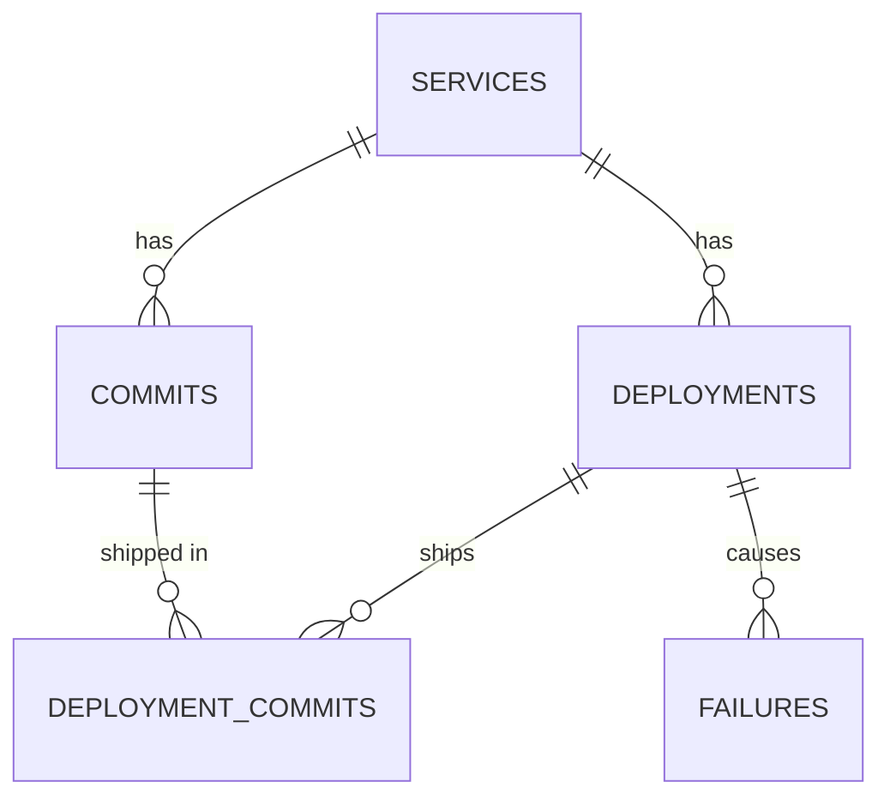

# 3T-APP-DESIGN — DORA Deployment Tracker

| | |
|---|---|
| **Author** | M.L. |
| **Status** | In build v0.16 (BOOO M11 complete) |
| **Date** | 2026-09-25 |
| **Scope** | Phase A — full stack running end-to-end and tested on localhost via Docker Compose |
| **Out of scope** | Phase B (AWS, IaC, GitHub Actions CI/CD, container orchestration, SSO) |
| **Phase B target** | AWS + GitHub Actions. Phase A honors the portability constraints in §14 but does no Phase B work. |

### Changelog
| Version | Changes |
|---|---|
| v0.1 | Initial draft |
| v0.2 | Review pass: aligned metric names with current DORA terminology; **rework rate promoted into Phase A**; tiers reframed as configurable benchmark bands and `overall_tier` removed; fixed the lead-time attribution bug; switched to strong ETags (weak ETags can never satisfy `If-Match`); container healthcheck uses `/healthz`; handled out-of-order ingest events; PostgreSQL 18 with `uuidv7()`; UTC-safe bucketing; added AWS/GitHub Actions portability constraints (§14); updated the golden dataset |
| v0.3 | Renamed to `3T-APP-DESIGN.md`. Added **self-tracking** (§15): the tracker records its own builds as deployments through its own ingest API, and `make up` records automatically. E2E now runs in an isolated Compose project so it can't wipe self-tracking history. Host ports are configurable. |
| v0.4 | §18 renamed **Build Order of Operations (BOOO)** with a status column. Recorded M0 implementation decisions (D17–D20). Node 24 pinned via `.nvmrc`. Local `FORWARDED_ALLOW_IPS=*` behind nginx. Repo layout matches the actual repo (`dora/`, doc under `docs/`). Fixed §16 reference to the self-tracking milestone (M11, not M10). |
| v0.5 | M1 decisions (D21–D25): bootstrap grants run as `dora_owner` and give a non-superuser caller `SET`-only membership (found by the RDS-style bootstrap test); Alembic connects with `search_path=pg_catalog`; all constraints explicitly named; `db` healthcheck over TCP; PostgreSQL 18 volume path; separate `DatabaseSettings` for one-shot processes. |
| v0.6 | M2 decisions (D26–D31): problem `type` URIs and the `errors[]` item shape; `If-Match` accepts `*` and lists; row locks make the version check atomic; failure `deployment_id` is patchable and revalidated; failure responses carry `service_id`; services commit explicitly. Default sorts and extra length limits documented in §7.3 and §7.5. |
| v0.7 | M3 decisions (D32–D37): `in_progress` must not carry `finished_at`; SHAs normalized to lowercase; commit upsert keeps the whole first-written row; `PATCH /deployments` accepts additive `commits[]`; `finished_at` can't move past a linked failure; list/detail shapes and sort order. |
| v0.8 | Commits are classified as **deployment commits** (shipped by ≥1 deployment) or **non-deployment commits** (D38). Deleting a service is blocked only by deployments; its non-deployment commits are deleted with it. |
| v0.9 | M4 decisions (D39–D42): 401 challenge header and auth-before-body; ingest response shape; partial updates from events; concurrent first deliveries collapse to one row. Coverage now traces greenlets, so reported coverage reflects code run through SQLAlchemy's async layer. |
| v0.10 | M5 decisions (D43–D48): time-series bucket assignment per metric; bands judge unrounded values and rounding is half-up; zero deployments give `per_day: null`; unknown `service_id` is 422; fractional window `days`; service filter as a constant SQL fragment. Golden datasets A, B, C pass exactly, and the weekly expectations for A are extended to every field. |
| v0.11 | M6 decisions (D49–D54): readiness probe is waited on, never cancelled; asyncpg connect and command timeouts; DB-unreachable errors are 503; unhandled errors become a problem+json 500 in middleware; route labels rebuilt from the route pattern; inbound request IDs validated. `/readyz` body shape and log field rules documented in §7.2 and §13. |
| v0.12 | M7 decisions (D55–D58): deterministic, repeatable seeding via COPY; lead-time query restructured to meet the performance target (852 → 272 ms p95); error diffusion in the seed and scenario 9 read over the seed window; host scripts target Python 3.10+. |
| v0.13 | M8 decisions (D59–D62): isolated codegen for the TypeScript 5 peer; the typed client and `ApiError`; URL-held dashboard filters; UTC bucket labels and fixed-unit axes. The dashboard renders the seeded bands and scenario 7's error state in a real browser. |
| v0.14 | M9 decisions (D63–D65) and a revision of D61 (preset windows end at the end of the current minute). Services, Deployments, and Failures pages verified in a real browser, including E2E scenarios 5, 6, and 8. |
| v0.15 | M10 decisions (D66–D70): isolated E2E stack with its own env file; scenario 10 pending M11; `compose.dev.yaml`; the multi-arch builder; `db` runs as `postgres`. §16 items ticked where verified; self-tracking remains for M11. |
| v0.16 | M11 decisions (D71–D75): release label format; no-op reruns and side-effect-free dry runs; script lint and tests on Python 3.10; `--repo`; scenario 10 compares commit sets. All ten E2E scenarios pass. |

---

## 1. Purpose

Build a three-tier web application that records deployments, the commits they ship, and the production failures they cause, and computes the **DORA software delivery performance metrics** from that data.

Phase A is complete when the whole stack starts cold with a single command, passes all automated tests (unit, integration, E2E), and shows correct DORA metrics for seeded and user-entered data.

This document is the **source of truth** for implementation. If implementation needs to deviate, update this doc and the Decision Log (§17) in the same change.

---

## 2. Goals and non-goals

### Goals
- CRUD for Services, Deployments, Commits (via Deployments), and Failures.
- A machine-facing **ingest endpoint** that GitHub Actions workflows will call in Phase B (idempotent, tolerant of retries and out-of-order events, API-key protected).
- A DORA metrics engine covering all **five** current metrics: point-in-time summary and time series, filterable by service, environment, and time window.
- `/healthz` (liveness), `/readyz` (readiness), `/metrics` (Prometheus), `/version` (build info).
- React dashboard plus management UI.
- One-command local run: `make up`. Cold start from an empty volume must succeed with no manual steps.
- Test coverage at the unit, integration, and E2E levels, runnable non-interactively (CI-ready).
- **Self-tracking:** the tracker records every one of its own builds as a deployment of the service `dora-tracker`, through its own ingest API (§15).

### Non-goals (Phase A)
- User authentication/SSO. The UI and CRUD APIs are unauthenticated locally. This is a **known, accepted risk** for localhost only.
- Multi-tenancy, RBAC.
- Any AWS resources, GitHub Actions workflows, ECR, IaC, or orchestration manifests.
- Integration with the existing Incident Tracker (a hook is reserved: `failures.external_ref`).

---

## 3. DORA metric definitions

DORA currently defines **five** software delivery performance metrics in two factors. *Throughput* covers change lead time, deployment frequency, and failed deployment recovery time. *Instability* covers change fail rate and deployment rework rate. "MTTR" was renamed **failed deployment recovery time**, and "change failure rate" is now **change fail rate**. Rework rate was added in the 2024 report. Source: dora.dev, *DORA's software delivery performance metrics* and *A history of DORA's software delivery metrics*.

All metrics are computed for **one environment** (default `production`) over a **window** `[from, to)` in UTC.

### Terms
- **Live deployment:** `status IN ('succeeded','rolled_back')`. A `rolled_back` deployment did reach the environment. A `failed` deployment never went live and is excluded from every metric.
- **Counted deployment:** a live deployment in the selected environment whose `finished_at` is in the window.

| Metric | Definition used in this app | Statistic |
|---|---|---|
| **Deployment frequency** | Number of counted deployments. | `count`, `per_day = count / window_days`, `deploy_days` (distinct UTC dates with ≥1 counted deployment) |
| **Change lead time** | For each commit, `first_live.finished_at − commit.committed_at`, where *first_live* is the **earliest live deployment of that commit in the selected environment across all time**, not just within the window. The commit is included only if *first_live* is a counted deployment. | median (p50), p90, sample size, excluded samples, in hours |
| **Change fail rate** | Counted deployments with ≥1 linked failure ÷ counted deployments. | ratio 0–1, numerator, denominator |
| **Failed deployment recovery time** | For **resolved** failures linked to counted deployments: `resolved_at − detected_at`. Open failures are excluded from the statistic but reported as a count. | median, sample size, `open_failures`, in hours |
| **Deployment rework rate** | Counted deployments with `kind = 'remediation'` ÷ counted deployments. A remediation deployment is unplanned and exists to fix a production issue (hotfix, patch). | ratio 0–1, numerator, denominator |

### Rules and edge cases
- **Rollback does not imply failure automatically.** A deployment is a change failure only if it has ≥1 row in `failures`. When a user marks a deployment `rolled_back` in the UI, the UI prompts them to create a failure record; the API never creates one implicitly. This keeps the metric deterministic and auditable.
- **Redeploys:** if a commit ships in several live deployments, only the earliest one counts for lead time. If that earliest deployment falls outside the window, the commit is excluded even though a later redeploy is inside the window.
- **Empty windows:** metrics with no data return `null`, never `0`. Returning `0` would make zero deployments look like a 0% fail rate.
- **Clock skew:** if `committed_at > finished_at` (bad pipeline data), exclude that commit from lead time and increment `excluded_samples`.
- **Timestamps:** stored as `timestamptz`, all math in UTC. The DB session timezone is forced to UTC (§7.8). The UI renders timestamps in the browser's local time.
- **Remediation and failures are independent.** A remediation deployment can itself cause a failure. Nothing is inferred between the two.

### Benchmark bands
DORA published elite/high/medium/low clusters through 2024, but the **2025 report replaced performance tiers with team archetypes**. The 2024 clusters also aren't monotonic: the high cluster had a higher change fail rate than the medium cluster. The app therefore shows **per-metric benchmark bands** as an informational aid. They are configured in `api/app/dora/bands.py`, and each band set is labeled with its source.

Default band set `dora-2023-adapted`:

| Metric | Elite | High | Medium | Low |
|---|---|---|---|---|
| Deployment frequency (per day) | ≥ 1 | ≥ 1/7 | ≥ 1/30 | < 1/30 |
| Change lead time (median hours) | < 24 | < 168 | < 720 | ≥ 720 |
| Change fail rate | ≤ 0.05 | ≤ 0.10 | ≤ 0.15 | > 0.15 |
| Recovery time (median hours) | < 1 | < 24 | < 168 | ≥ 168 |
| Rework rate | — | — | — | — (no published bands, so `band` is always `null`) |

There is **no overall/composite band**. DORA never defined one, and a single grade invites misuse as a team leaderboard. The UI shows a note beside the bands: *"Benchmarks are for team self-improvement, not cross-team comparison."*

---

## 4. Architecture

```
 Browser
   │  http://localhost:8080
   ▼
┌──────────────────────────────┐
│ web  (nginx-unprivileged)    │  serves the React static build
│   /        → SPA             │
│   /api/*   → proxy api:8000  │  single origin: no CORS anywhere
│   /healthz /readyz /version  │  → proxy api:8000 (NOT /metrics)
└──────────────┬───────────────┘
               ▼
┌──────────────────────────────┐
│ api  (FastAPI + Uvicorn)     │  /api/v1/*, /healthz, /readyz, /metrics, /version
│   SQLAlchemy 2 async/asyncpg │  role: dora_app (DML only)
└──────────────┬───────────────┘
               ▼
┌──────────────────────────────┐        ┌──────────────────────────┐
│ db  (PostgreSQL 18)          │◄───────│ migrate (Alembic, 1-shot)│
│   schema: dora               │        │ role: dora_owner (DDL)   │
│   named volume: pgdata       │        └──────────────────────────┘
└──────────────────────────────┘
        ▲
        └── seed (profile: seed, 1-shot) — deterministic demo data
```

**Startup order (enforced by Compose):**
`db` healthy → `migrate` exited 0 → `api` healthy → `web`.

The frontend build output is plain static files, and the API is addressed only by the relative path `/api/v1`. Phase B can therefore serve the SPA from nginx in a container or from S3 + CloudFront without code changes.

---

## 5. Technology choices

Pin exact versions in lockfiles at implementation time. Use the latest stable release in each line below.

| Layer | Choice | Notes |
|---|---|---|
| Frontend | React 19, TypeScript (strict), Vite | |
| Data fetching | TanStack Query | |
| Routing | React Router | |
| Forms | React Hook Form + Zod | |
| Charts | Recharts | |
| API types | `openapi-typescript`, generated from the FastAPI schema; `openapi-fetch` client | generated contract; `make openapi-check` fails on drift. Codegen runs from its own package, `web/tools/openapi`, because `openapi-typescript` 7 requires TypeScript 5 while the app uses 6 (D59) |
| Styling | CSS Modules | |
| Frontend tests | Vitest + Testing Library; Playwright for E2E | |
| Node (build only) | Node 24 LTS | |
| Backend | Python 3.13, FastAPI, Uvicorn | |
| ORM / driver | SQLAlchemy 2.x (async), asyncpg | |
| Migrations | Alembic, with `version_table_schema="dora"` | runs only in the `migrate` container |
| Validation / config | Pydantic v2, pydantic-settings | |
| Logging | structlog (JSON to stdout) + request-ID middleware | |
| Metrics | prometheus-client | |
| Python tooling | uv (deps + lockfile), ruff, mypy (strict on `app/`) | |
| Backend tests | pytest, pytest-asyncio, httpx `AsyncClient`, Testcontainers (PostgreSQL) | **never SQLite** |
| Database | PostgreSQL **18** (pin the minor tag to one Amazon RDS currently supports, e.g. `18.6`) | same major version as the Phase B RDS target |
| Web server | `nginxinc/nginx-unprivileged` | non-root, listens on 8080 |

---

## 6. Data model

### 6.1 ER diagram



### 6.2 Reference DDL

Alembic migrations are authoritative, and this DDL is the target they must produce. Schema: `dora`.

- Primary keys use **UUIDv7**, via the native `uuidv7()` added in PostgreSQL 18. Its time-ordered values give far better B-tree index locality than random v4 UUIDs.
- Enumerations use `text` + `CHECK` rather than native `ENUM` types, because native enums are painful to alter under migrations.
- Every constraint and index has an explicit name (D24). Constraints the DDL below leaves unnamed get `pk_<table>`, `uq_<table>_<column>`, `fk_<table>_<column>`, or `ck_<table>_<column>` names in the migrations.

```sql
CREATE TABLE dora.services (
    id          uuid PRIMARY KEY DEFAULT uuidv7(),
    slug        text NOT NULL UNIQUE CHECK (slug ~ '^[a-z0-9][a-z0-9-]{1,62}$'),
    name        text NOT NULL CHECK (length(name) BETWEEN 1 AND 200),
    owner_team  text NOT NULL CHECK (length(owner_team) BETWEEN 1 AND 100),
    repo_url    text,
    version     integer NOT NULL DEFAULT 1,
    created_at  timestamptz NOT NULL DEFAULT now(),
    updated_at  timestamptz NOT NULL DEFAULT now()
);

CREATE TABLE dora.deployments (
    id            uuid PRIMARY KEY DEFAULT uuidv7(),
    service_id    uuid NOT NULL REFERENCES dora.services(id) ON DELETE RESTRICT,
    environment   text NOT NULL CHECK (environment IN ('development','staging','production')),
    kind          text NOT NULL DEFAULT 'planned' CHECK (kind IN ('planned','remediation')),
    release       text NOT NULL CHECK (length(release) BETWEEN 1 AND 100),
    head_sha      text CHECK (head_sha ~ '^[0-9a-f]{7,40}$'),
    status        text NOT NULL CHECK (status IN ('in_progress','succeeded','failed','rolled_back')),
    started_at    timestamptz NOT NULL,
    finished_at   timestamptz,
    deployed_by   text,
    pipeline_url  text,
    external_id   text,                                   -- pipeline run ID; idempotency key
    version       integer NOT NULL DEFAULT 1,
    created_at    timestamptz NOT NULL DEFAULT now(),
    updated_at    timestamptz NOT NULL DEFAULT now(),
    CONSTRAINT finished_after_started CHECK (finished_at IS NULL OR finished_at >= started_at),
    CONSTRAINT terminal_has_finish   CHECK (status = 'in_progress' OR finished_at IS NOT NULL),
    CONSTRAINT uq_service_external   UNIQUE (service_id, external_id)
);

CREATE INDEX ix_deployments_live
    ON dora.deployments (environment, finished_at, service_id)
    WHERE status IN ('succeeded','rolled_back');
CREATE INDEX ix_deployments_service_started ON dora.deployments (service_id, started_at DESC);

CREATE TABLE dora.commits (
    id            uuid PRIMARY KEY DEFAULT uuidv7(),
    service_id    uuid NOT NULL REFERENCES dora.services(id) ON DELETE RESTRICT,
    sha           text NOT NULL CHECK (sha ~ '^[0-9a-f]{7,40}$'),
    committed_at  timestamptz NOT NULL,
    author        text,
    message       text,
    created_at    timestamptz NOT NULL DEFAULT now(),
    CONSTRAINT uq_service_sha UNIQUE (service_id, sha)
);

CREATE TABLE dora.deployment_commits (
    deployment_id uuid NOT NULL REFERENCES dora.deployments(id) ON DELETE CASCADE,
    commit_id     uuid NOT NULL REFERENCES dora.commits(id) ON DELETE RESTRICT,
    PRIMARY KEY (deployment_id, commit_id)
);
CREATE INDEX ix_deployment_commits_commit ON dora.deployment_commits (commit_id);

CREATE TABLE dora.failures (
    id             uuid PRIMARY KEY DEFAULT uuidv7(),
    deployment_id  uuid NOT NULL REFERENCES dora.deployments(id) ON DELETE RESTRICT,
    severity       text NOT NULL CHECK (severity IN ('sev1','sev2','sev3','sev4')),
    summary        text NOT NULL CHECK (length(summary) BETWEEN 1 AND 500),
    detected_at    timestamptz NOT NULL,
    resolved_at    timestamptz,
    external_ref   text,
    version        integer NOT NULL DEFAULT 1,
    created_at     timestamptz NOT NULL DEFAULT now(),
    updated_at     timestamptz NOT NULL DEFAULT now(),
    CONSTRAINT resolved_after_detected CHECK (resolved_at IS NULL OR resolved_at >= detected_at)
);
CREATE INDEX ix_failures_deployment ON dora.failures (deployment_id);
```

### 6.3 Business rules (service layer; these return 409 or 422, never raw DB errors)
- A failure may only reference a **live** deployment, and its `detected_at` must be ≥ that deployment's `finished_at`.
- **Immutable after create:** `services.slug`; `deployments.service_id`, `environment`, and `external_id`; `commits.sha` and `commits.committed_at`. Sending a different value returns 422.
- **Commit upsert:** if a commit is posted again with a **different** `committed_at`, the first write wins and a warning is logged with both values. The request still succeeds, because pipelines should not fail over this.
- **Commit classification (D38):** a commit is a **deployment commit** while at least one deployment links it through `deployment_commits`, and a **non-deployment commit** otherwise, for example after the only deployment that shipped it was deleted. The classification is derived from the links on every read and never stored, so it can't drift.
- Deleting a service that has deployments returns 409, and the detail counts its deployment commits. A service with no deployments can be deleted; its non-deployment commits, which no metric reads, are deleted with it in the same transaction. Deleting a deployment that has failures returns 409. Deleting a deployment keeps its commits; any it alone shipped become non-deployment commits.
- `updated_at` and `version` are bumped by the application on every **effective** change. A no-op update does not bump them.
- Map constraint violations (`UNIQUE`, `CHECK`, `FK`) to problem+json responses in one exception handler, as a backstop.

### 6.4 Database roles (least privilege, portable to Amazon RDS)

Role setup is split so the **same SQL works locally and on RDS**, where there is no true superuser (the RDS master user has `rds_superuser`).

| Step | File | Runs as | Local | Phase B (RDS) |
|---|---|---|---|---|
| 1. Bootstrap roles + schema | `db/bootstrap.sql` (idempotent) | admin | `db/init/01-bootstrap.sh` via `/docker-entrypoint-initdb.d` | run once as the RDS master user |
| 2. Default privileges | first Alembic migration | `dora_owner` | `migrate` container | migration job |

`db/bootstrap.sql` must be idempotent (`DO $$ ... IF NOT EXISTS ... $$`) and must:
- create the roles `dora_owner` (login) and `dora_app` (login), taking passwords from psql variables;
- if the caller is not a superuser (the RDS master user), grant it `dora_owner` membership with `SET TRUE, INHERIT FALSE`, which `CREATE SCHEMA ... AUTHORIZATION` requires (D21);
- run `CREATE SCHEMA IF NOT EXISTS dora AUTHORIZATION dora_owner;`
- run `GRANT USAGE ON SCHEMA dora TO dora_app;` **as `dora_owner`** (`SET ROLE dora_owner; ... RESET ROLE;`), because a non-superuser holds no grant option on a schema it doesn't own (D21);
- run `ALTER ROLE dora_owner SET search_path = dora;` and `ALTER ROLE dora_app SET search_path = dora;`
- be executed against database `dora` (`POSTGRES_DB=dora` locally).

The first Alembic migration, running as `dora_owner`, executes:

```sql
ALTER DEFAULT PRIVILEGES IN SCHEMA dora GRANT SELECT, INSERT, UPDATE, DELETE ON TABLES TO dora_app;
```

It runs this *before* creating tables, which avoids needing role membership that the RDS master user may not have.

> ⚠ Docker init scripts run **only when the data volume is empty**. Changing roles later requires `make reset` locally.

---

## 7. API specification

### 7.1 Conventions
- Base path: `/api/v1`. JSON only. Timestamps are ISO 8601 with offset; responses are always UTC (`Z`).
- **Errors:** `application/problem+json` per RFC 9457. The body has `type`, `title`, `status`, `detail`, `instance`, plus `errors[]` for field validation. Override FastAPI's default 422 body.
  - `type` is `urn:dora:problem:<slug>` for domain problems (`validation`, `not-found`, `conflict`, `precondition-failed`, `precondition-required`, `unauthorized`) and `about:blank` for plain HTTP errors such as an unknown route (D26).
  - Each `errors[]` item is `{ "location": "body"|"query"|"path"|"header", "field": "<dotted.path>", "message": "...", "type": "..." }`. The UI keys inline field errors on `field`.
- **Pagination:** `?limit=` (default 50, max 200) and `&offset=`. The envelope is `{ "items": [...], "total": n, "limit": n, "offset": n }`.
- **Sorting:** `?sort=field` or `?sort=-field` against a per-resource whitelist.
- **Optimistic concurrency:**
  - Single-resource `GET`, `POST`, and `PATCH` responses include a **strong** `ETag: "<version>"`, and the body also carries `version`.
  - `PATCH` and `DELETE` require `If-Match: "<version>"`. A missing header returns `428 Precondition Required`; a mismatch returns `412 Precondition Failed`. Per RFC 9110, `If-Match: *` and comma-separated lists are accepted (D27).
  - Writes lock the row (`SELECT ... FOR UPDATE`) before comparing versions, so two writers holding the same ETag can't both succeed (D28).
  - ⚠ Do **not** use weak ETags (`W/"..."`). `If-Match` uses strong comparison (RFC 9110), so a weak ETag never matches and every write would fail with 412.
- **Request ID:** accept an inbound `X-Request-ID` if it matches `^[A-Za-z0-9._:-]{1,128}$`, or else generate a UUIDv4 (D54). Echo it in the response, including on 500s, and include it in every log line. Also log `X-Amzn-Trace-Id` when present (the AWS load balancer adds it in Phase B).
- **Database unavailable:** a connection-level failure (refused, timed out, dropped) returns `503` problem+json with type `urn:dora:problem:database-unavailable` and `Retry-After: 5`, never a crash (D51). Unhandled errors return a `500` problem+json with no internal detail (D52).

### 7.2 Operational endpoints (root, not under `/api/v1`)

| Method | Path | Behavior |
|---|---|---|
| GET | `/healthz` | **Liveness.** Returns `200 {"status":"ok"}` with no dependency checks and never touches the DB. The container `HEALTHCHECK` uses this endpoint (§10). |
| GET | `/readyz` | **Readiness.** Runs `SELECT 1` with a 2s timeout. Returns `200 {"status":"ready","checks":{"database":"ok"}}`, or `503 {"status":"not_ready","checks":{"database":"timeout"|"error"}}`. The probe is waited on, never cancelled, and at most one is in flight (D49). |
| GET | `/metrics` | Prometheus exposition: request count and latency histogram labeled by **route template** (never the raw path), plus DB pool gauges. Not routed through nginx. |
| GET | `/version` | `{"version": "<APP_VERSION>", "git_sha": "<GIT_SHA>", "build_time": "<BUILD_TIME>"}`, taken from build args. Lets you verify exactly which build is deployed, and later lets this app track its own deployments. |

Log these four endpoints at DEBUG only.

### 7.3 Services

| Method | Path | Notes |
|---|---|---|
| GET | `/services` | filter `?owner_team=` (exact), `?q=` (slug/name contains, case-insensitive, `%` and `_` match literally); sort `name` (default), `created_at` |
| POST | `/services` | 201 + `Location` + `ETag`; 409 on duplicate slug |
| GET | `/services/{id}` | 404 if missing; `ETag` |
| PATCH | `/services/{id}` | partial update; `slug` is immutable |
| DELETE | `/services/{id}` | 204, also deleting the service's non-deployment commits; 409 if it has deployments (D38) |

### 7.4 Deployments

| Method | Path | Notes |
|---|---|---|
| GET | `/deployments` | filters: `service_id`, `environment`, `status`, `kind`, `from` (inclusive), `to` (exclusive), both on `started_at` and offset-aware; sort `started_at` (default `-started_at`), `finished_at` (unfinished deployments sort last in both directions). List items are summaries without `commits`/`failures` (D37). |
| POST | `/deployments` | body may include `commits[]` (max 500), upserted by `(service_id, sha)`. Unknown `service_id` → 422; duplicate `external_id` for the service → 409. |
| GET | `/deployments/{id}` | includes `commits[]` (newest `committed_at` first) and `failures[]` summaries (by `detected_at`) |
| PATCH | `/deployments/{id}` | status changes follow §7.7; immutable fields per §6.3. `commits[]` is additive: new commits are upserted and linked, existing links are never removed, and a new link bumps `version` (D35). |
| DELETE | `/deployments/{id}` | 409 if it has failures |

Create request example:

```json
{
  "service_id": "01929b3e-7c2a-7f65-9a3e-0a4a2b8f9d11",
  "environment": "production",
  "kind": "planned",
  "release": "v1.4.2",
  "head_sha": "9f2c1ab",
  "status": "succeeded",
  "started_at": "2026-09-20T10:00:00Z",
  "finished_at": "2026-09-20T10:07:30Z",
  "deployed_by": "github-actions",
  "pipeline_url": "https://github.com/org/repo/actions/runs/123",
  "commits": [
    { "sha": "9f2c1ab", "committed_at": "2026-09-19T20:00:00Z", "author": "dev@example.com", "message": "fix: retry on 503" }
  ]
}
```

### 7.5 Failures

| Method | Path | Notes |
|---|---|---|
| GET | `/failures` | filters: `service_id`, `deployment_id`, `severity`, `open=true|false`; sort `detected_at` (default `-detected_at`), `created_at` |
| POST | `/failures` | validates the §6.3 rules: unknown `deployment_id` → 422; deployment not live → 409; `detected_at` before the deployment's `finished_at`, or `resolved_at` before `detected_at` → 422. Responses include the deployment's `service_id` (D30). |
| GET | `/failures/{id}` | |
| PATCH | `/failures/{id}` | typical use: set `resolved_at` (send `null` to reopen). `deployment_id` may be changed and is revalidated like a create (D29). |
| DELETE | `/failures/{id}` | 204 |

### 7.6 Ingest (machine-facing; called by GitHub Actions in Phase B)

`POST /api/v1/events/deployments`

- **Auth:** header `X-API-Key` must match `INGEST_API_KEY`, compared with `hmac.compare_digest`. Missing or invalid returns 401 with `WWW-Authenticate: ApiKey realm="dora-ingest", header="X-API-Key"`. The key is checked before the body is validated, so an unauthenticated caller learns nothing about the schema (D39). The key is never logged. This is the only authenticated endpoint in Phase A.
- **Identifies** the service by `service_slug`. An unknown slug returns 422. Services are **never** auto-created, so a pipeline typo can't create junk services.
- **Idempotent upsert** on `(service, external_id)`, where `external_id` is required. Recommended format for GitHub Actions: `gha-<run_id>-<run_attempt>-<environment>`.
  - A new record returns `201`.
  - An existing record gets the change applied and returns `200` with the resource.
  - An identical replay returns `200` with no change and no version bump.
  - A **stale event** (see §7.7) returns `200` with the current resource, unchanged, plus a `Warning`-style field `"ignored": "stale_event"`. This is not an error, because CI retries and out-of-order delivery are normal.
- A pipeline typically posts `in_progress` at job start and the terminal status at job end. `kind` defaults to `planned`; a hotfix workflow sends `remediation`.
- **Response:** the deployment detail (as `GET /deployments/{id}`) plus `ignored`, which is `null` unless the event was stale. `201` adds `Location`; every response carries `ETag` (D40).
- **Updates are partial:** on an existing deployment, only the fields present in the event are applied. An omitted field is left unchanged; in particular the `kind` default applies only at creation. `commits[]` is additive, as with `PATCH` (D35, D41). `environment` and `external_id` are immutable (422).
- **A stale event changes nothing at all,** not even its non-status fields.
- **Concurrent first deliveries** of a new `external_id` produce exactly one deployment: the insert runs in a savepoint, and a unique violation (or a duplicate that became visible) turns the losing request into an update (D42).
- Ingest and CRUD share the `(service, external_id)` space: an event whose `external_id` matches a CRUD-created deployment updates it.

```json
{
  "service_slug": "checkout-api",
  "external_id": "gha-123456789-1-production",
  "environment": "production",
  "kind": "planned",
  "release": "v1.4.2",
  "head_sha": "9f2c1ab",
  "status": "succeeded",
  "started_at": "2026-09-20T10:00:00Z",
  "finished_at": "2026-09-20T10:07:30Z",
  "deployed_by": "github-actions",
  "pipeline_url": "https://github.com/org/repo/actions/runs/123456789",
  "commits": [ { "sha": "9f2c1ab", "committed_at": "2026-09-19T20:00:00Z" } ]
}
```

### 7.7 Deployment status transitions

| From → To | Via CRUD `PATCH` | Via ingest |
|---|---|---|
| `in_progress` → `succeeded` / `failed` | ✅ (requires `finished_at`) | ✅ |
| `succeeded` → `rolled_back` | ✅ | ✅ |
| same → same | no-op | no-op |
| terminal (`succeeded`/`failed`/`rolled_back`) → `in_progress` | ❌ 409 | **stale event**: ignored, 200 |
| `rolled_back` → `succeeded` | ❌ 409 | **stale event**: ignored, 200 |
| any other change | ❌ 409 | ❌ 409 (a genuine conflict, e.g. `succeeded` → `failed`) |

Every 409 carries a problem detail naming the invalid transition.

### 7.8 Metrics

`GET /api/v1/metrics/dora`

Query parameters: `service_id` (optional; omit for org-wide), `environment` (default `production`), `from` and `to` (default: last 30 days ending now; max span 365 days, else 422).

```json
{
  "window": { "from": "2026-09-01T00:00:00Z", "to": "2026-10-01T00:00:00Z", "days": 30 },
  "filters": { "service_id": null, "environment": "production" },
  "band_set": "dora-2023-adapted",
  "deployment_frequency": { "count": 4, "per_day": 0.1333, "deploy_days": 4, "band": "medium" },
  "change_lead_time": { "median_hours": 19.0, "p90_hours": 24.0, "sample_size": 4, "excluded_samples": 0, "band": "elite" },
  "change_fail_rate": { "rate": 0.5, "failed_deployments": 2, "total_deployments": 4, "band": "low" },
  "failed_deployment_recovery_time": { "median_hours": 2.0, "sample_size": 2, "open_failures": 1, "band": "high" },
  "deployment_rework_rate": { "rate": 0.25, "remediation_deployments": 1, "total_deployments": 4, "band": null }
}
```

`GET /api/v1/metrics/dora/timeseries` takes the same filters plus `bucket=day|week|month` (default `week`). It returns `{ "window": {...}, "filters": {...}, "bucket": "week", "points": [ { "start": "...", "deployment_count": n, "median_lead_time_hours": x|null, "change_fail_rate": x|null, "median_recovery_hours": x|null, "rework_rate": x|null } ] }`. Empty buckets are included, with count `0` and the other fields `null`.

**Bucket assignment (D43):** a deployment's count, fail and rework facts go in the bucket of its `finished_at`. A lead-time sample goes in the bucket of the commit's first live deployment. A recovery sample goes in the bucket of the failed deployment's `finished_at`, not its `resolved_at`, so a bucket's recovery figure describes the failures its own deployments caused.

**Window (D47):** `from` and `to` are offset-aware and normalized to UTC. `from` must be before `to`. Omitting both gives the 30 days ending now; giving only `to` gives the 30 days ending then. `days` is the window's exact length in days and may be fractional; `per_day` divides by it. An unknown `service_id` is 422 (D46).

**Implementation requirements:**
- Compute aggregations in SQL: `percentile_cont(0.5 / 0.9) WITHIN GROUP (ORDER BY EXTRACT(EPOCH FROM interval) / 3600)`. Do not load rows into Python.
- Lead time uses a CTE that finds `min(finished_at)` per commit across **all** live deployments in the environment, then filters to the window (§3).
- **UTC safety:** `date_trunc` on `timestamptz` depends on the session timezone. Set the connection's `timezone=UTC` through asyncpg `server_settings` **and** use the explicit form `date_trunc('week', ts, 'UTC')`. The same applies to `deploy_days`.
- Band classification happens in Python from the aggregates (a pure function). Round hours to 2 decimals and rates to 4.
  - Bands judge the **unrounded** value, so a displayed `0.1429` is still compared with 1/7 exactly. Rounding is half-up, not Python's banker's rounding (D44).
  - With zero counted deployments, `per_day` is `null` and its band is `null`, as golden dataset B requires; `count` and `deploy_days` are `0` (D45).
- Lead time groups every live deployment-commit link in the environment by commit, joining `commits` **before** grouping, and keeps only commits whose minimum `finished_at` falls in the window (`HAVING`). Both percentiles come from one sort (`percentile_cont(ARRAY[0.5, 0.9])`), and the metrics transaction sets `SET LOCAL work_mem = '16MB'` so sorts stay in memory (D56).
- The optional service filter is appended as a constant SQL fragment rather than written as `(:id IS NULL OR ...)`, which would defeat index use under prepared-statement generic plans. Every value is a bound parameter (D48).

---

## 8. Frontend specification

| Route | Page | Key behavior |
|---|---|---|
| `/` | **Dashboard** | Filters: service (all or one), environment, window preset (7/30/90 days, custom). Five metric cards showing value, band badge (where applicable), and sample size, with throughput and instability cards grouped. Weekly time-series charts. The benchmark disclaimer from §3. An empty state when there's no data. |
| `/services` | Services list | Search, create, table linking to detail |
| `/services/:id` | Service detail | Edit form; that service's DORA summary; recent deployments |
| `/deployments` | Deployments list | Filters (service, env, status, kind, date range), pagination, status and kind badges |
| `/deployments/new`, `/deployments/:id` | Deployment form/detail | Commits sub-list; offers only valid status transitions; marking `rolled_back` opens a "Record failure?" dialog |
| `/failures` | Failures list | Open/resolved filter; "Resolve" sets `resolved_at = now` (editable) |

**Cross-cutting requirements:**
- One typed API client built on the generated OpenAPI types. There are no hand-written response types. Every failure becomes an `ApiError` carrying the problem body and `X-Request-ID`; network failures are status 0 (D60).
- Dashboard filters live in the URL (`?service=&env=&window=7|30|90|custom&from=&to=`), so views can be bookmarked; defaults are omitted. Presets end at the end of the current minute; custom ranges are local dates with an inclusive end date (D61).
- Time-series bucket labels show the bucket's **UTC** calendar date, because buckets are UTC-defined; every other timestamp renders in local time. Chart axes use one fixed unit (hours, percent) while values and tooltips adapt (D62).
- Each chart has a visually hidden data table with the same numbers. An empty window shows an empty state rather than cards full of zeros. Queries retry a 5xx up to twice, never a 4xx.
- **Write errors, one policy (D63):** a 412 shows *"This record was changed by someone else"* in a toast with the request ID and reloads the record; server field errors appear inline on the matching input; anything else is a toast with the request ID. Forms validate with Zod first for fast feedback, but the API stays the source of truth.
- **Dialogs** use the native `<dialog>` element, which supplies the focus trap, Escape, and an inert background (D64). The deployment page offers only §7.7's forward moves; completing an in-progress deployment sets `finished_at` to now (D65). `datetime-local` inputs are local wall time, sent to the API as UTC ISO strings.
- Phase A has no delete buttons in the UI; the API's DELETE endpoints remain for scripts and cleanup.
- Mutations send `If-Match: "<version>"`, using the `version` from the response body. On `412`, show "This record was changed by someone else" and refetch.
- Render problem+json errors: field errors appear inline, and anything else appears in a toast showing the `X-Request-ID`.
- Loading, empty, and error states exist for every data view.
- Accessibility: semantic HTML, labeled inputs, keyboard-navigable dialogs, and badges that carry text rather than relying on color alone.
- The API base is always the relative `/api/v1`. In dev mode the Vite dev server **proxies** `/api` to the API, so there is no CORS configuration anywhere.

---

## 9. Configuration

All configuration comes from environment variables via pydantic-settings. The repo commits `.env.example`; `.env` is gitignored. The app must start with **only** env vars, with no config files required, so Phase B can inject values from AWS Secrets Manager or Parameter Store.

| Variable | Service | Example | Notes |
|---|---|---|---|
| `POSTGRES_PASSWORD` | db | `change-me` | local bootstrap only |
| `DORA_OWNER_PASSWORD` | db, migrate | `change-me` | |
| `DORA_APP_PASSWORD` | db, api, seed | `change-me` | |
| `DB_HOST` / `DB_PORT` / `DB_NAME` | api, migrate, seed | `db` / `5432` / `dora` | discrete parts rather than one URL, which maps cleanly to RDS secret JSON |
| `DB_USER` / `DB_PASSWORD` | api, migrate, seed | `dora_app` / … | the migrate container gets the owner credentials |
| `DB_SSL_MODE` | api, migrate, seed | `disable` locally | `disable` \| `require` \| `verify-full`; mapped to asyncpg's `ssl` argument (asyncpg does not read `sslmode` from a SQLAlchemy URL the way libpq does) |
| `DB_SSL_ROOT_CERT` | api, migrate, seed | empty | path to a CA bundle when using `verify-full` |
| `DB_POOL_SIZE` / `DB_MAX_OVERFLOW` | api | `10` / `5` | |
| `INGEST_API_KEY` | api | 32+ random chars | the app refuses to start if it's unset or shorter than 32 chars. `.env.example` ships a valid dev-only key so `cp .env.example .env && make up` works (D19). |
| `LOG_LEVEL` | api | `INFO` | |
| `APP_ENV` | api | `local` | |
| `ENABLE_API_DOCS` | api | `true` locally | controls `/docs` and `/openapi.json` exposure |
| `PORT` | api | `8000` | bind address is always `0.0.0.0` |
| `FORWARDED_ALLOW_IPS` | api | `*` locally; the load balancer's range in Phase B | passed to Uvicorn's `forwarded_allow_ips`, so client IPs are correct behind a proxy or load balancer. Locally nginx reaches the api from a Compose network address, and the api's host port is bound to `127.0.0.1` only. The app's own default is `127.0.0.1`. |
| `APP_VERSION` / `GIT_SHA` / `BUILD_TIME` | api (build args → env) | `0.1.0` / full 40-char SHA / ISO time | served by `/version` and written as OCI image labels. The Makefile passes them from `git` into `docker compose build` via `build.args` interpolation. Default to `unknown` when unset, so a plain `docker compose up` still works. |
| `WEB_PORT` / `API_PORT` / `DB_PORT_HOST` | compose (host side only) | `8080` / `8000` / `5432` | host port mappings, so the isolated E2E project (§15.5) can run beside the dev stack |
| `DORA_API_URL` | `scripts/record_deploy.py` | `http://localhost:8080` | where the self-tracking script posts |

Engine settings: `pool_pre_ping=True` and `pool_recycle=1800`. This lets connections survive DB restarts, failovers, and credential rotation.

---

## 10. Local runtime (Docker Compose)

### Files
- `compose.yaml` is the default production-like stack.
- `compose.dev.yaml` adds hot reload: the Vite dev server on 5173 with an `/api` proxy, `uvicorn --reload`, and bind mounts.
  - `api` runs `uvicorn --reload` against `./api/app` (bind-mounted read-only) with docs on; `web-dev` runs the Vite dev server from the stock `node:24` image with `node_modules` in a named volume, so Linux binaries never land in the host checkout. `web-dev` runs as root: it's dev-only tooling, not an image this project builds (D68).

> ⚠ Do **not** name the dev file `compose.override.yaml`. Compose merges that file automatically on every `up`.

### Service requirements

| Service | Image / build | Requirements |
|---|---|---|
| `db` | `postgres:18.6` (pinned) | named volume `pgdata` mounted at `/var/lib/postgresql` (PostgreSQL 18 images keep `PGDATA` under `/var/lib/postgresql/18/docker`); healthcheck `pg_isready -h 127.0.0.1 -U postgres -d dora` over TCP (D23); runs as `user: postgres` so `exec` is non-root too (D70); port `127.0.0.1:${DB_PORT_HOST:-5432}:5432` |
| `migrate` | `api` image, `alembic upgrade head` | `depends_on: db: service_healthy`; `restart: "no"` |
| `api` | `./api` multi-stage | `depends_on: migrate: service_completed_successfully`; **`HEALTHCHECK` targets `/healthz`** using Python `urllib` (no curl in slim images); non-root UID 10001; port `127.0.0.1:${API_PORT:-8000}:8000` |
| `web` | `./web` multi-stage (Node 24 build → nginx-unprivileged) | `depends_on: api: service_healthy`; port `127.0.0.1:${WEB_PORT:-8080}:8080` |
| `seed` | `api` image, `python -m app.seed` | `profiles: ["seed"]`; depends on `api` healthy |

**Why the container healthcheck uses `/healthz` rather than `/readyz`:** orchestrators restart or replace containers that fail their health check. If that check depended on the DB, a database blip would kill every API container at once and turn a brief outage into a full one. `/readyz` exists for traffic-routing decisions, and E2E scenario 7 proves the difference. Gating startup on `/healthz` is still safe here, because `migrate` has already proven the DB is reachable.

**Image requirements (all images):**
- Multi-stage builds, pinned base tags, non-root user, `.dockerignore`, and no secrets in any layer.
- Exec-form `CMD`/`ENTRYPOINT`, so the app runs as PID 1 and receives `SIGTERM`. Uvicorn runs with `--timeout-graceful-shutdown 20`, which is less than typical orchestrator stop timeouts.
- **Architecture-neutral:** images build on both `linux/amd64` and `linux/arm64`. Use no arch-specific binaries, and prefer wheels that exist for both.
- OCI labels `org.opencontainers.image.{revision,version,created,source}` come from build args.
- Python images set `PYTHONDONTWRITEBYTECODE=1` and `PYTHONUNBUFFERED=1`.

**nginx:**
- Upstream host and port are templated via the image's built-in `/etc/nginx/templates/*.template` envsubst support (`API_UPSTREAM=api:8000`). They are never hardcoded.
- `gzip` applies to static assets only, **not** to the `/api` location. nginx's gzip module downgrades strong ETags to weak, which would break `If-Match` (§7.1).
- Proxy exactly `/api/`, `/healthz`, `/readyz`, and `/version` to the API. **Do not** proxy `/metrics`; a test asserts it returns the SPA or 404, never Prometheus output. Self-tracking (§15.4) relies on `/readyz` and `/version` being reachable through nginx.
- Use SPA fallback (`try_files $uri /index.html`). Hashed assets get long cache headers; `index.html` gets `no-cache`.

### Seed data
`python -m app.seed --days 90 --seed 42` is deterministic. It creates 6 services with distinct profiles:

| Service | Profile |
|---|---|
| `checkout-api` | several deploys per day, low fail rate, fast recovery, ~3% remediation |
| `catalog-svc` | roughly daily deploys, moderate metrics |
| `payments-gw` | weekly deploys, occasional sev1, ~15% remediation |
| `legacy-billing` | monthly deploys, high fail rate, slow recovery, ~30% remediation |
| `search-indexer` | staging-heavy, few production deploys |
| `new-svc` | no deployments (exercises empty states) |

`--large` generates ~100k deployments for the performance check (§12).

- **Deterministic:** the same `--seed`, `--days`, and `--end` (default: today, midnight UTC) produce identical rows, including UUIDs and SHAs. Timestamps are offsets from `--end`, so the data has the same shape whichever day it's generated.
- **Repeatable:** `make seed` replaces seed-managed services (the six profile slugs plus `load-svc-*`) in one transaction and never touches any other service, such as `dora-tracker`. It runs as `dora_app` and loads with `COPY`; `make seed-large` loads ~100k deployments in about 20 seconds (D55).
- **Realistic:** a deployment links only the commits new to its environment since that environment's last deployment; a failed pipeline leaves them to ship next time. Commits always predate the first deployment that ships them. Rates use error diffusion, so each service realizes its profile even from a handful of deployments (D57).
- After seeding, the Makefile runs `ANALYZE` as `postgres`, because `dora_app` can't analyze tables it doesn't own.

### Makefile targets

Every target is **non-interactive, exits non-zero on failure, and needs no TTY**, so the same targets run unchanged in GitHub Actions.

| Target | Action |
|---|---|
| `make up` | Captures `DEPLOY_STARTED_AT`, exports `GIT_SHA`/`BUILD_TIME`, runs `docker compose up -d --build --wait web` (scoping `--wait` to `web` avoids known Compose issues with one-shot services), then runs `record-deploy` **best-effort**. A recording failure prints a warning and never fails `make up`. Set `RECORD=0` to skip recording. |
| `make record-deploy` | Runs `scripts/record_deploy.py` against the running stack (§15). Idempotent: running it twice for the same build records one deployment. |
| `make dev` | `docker compose -f compose.yaml -f compose.dev.yaml up --build` |
| `make down` | stop the stack, keep data |
| `make reset` | `down -v`, then `up`. ⚠ This **deletes self-tracking history** along with everything else. The first deployment after a reset records only the HEAD commit (§15.3). |
| `make seed` | `docker compose --profile seed run --rm seed`, then `ANALYZE` |
| `make seed-large` | the seed plus `--large` (~100k deployments), then `ANALYZE` |
| `make perf` | `scripts/perf_check.py`: times the org-wide 90-day summary and time series; fails if the summary p95 is 500 ms or more |
| `make migrate` / `make migration m="msg"` | apply migrations / autogenerate a revision |
| `make test` | `test-api`, `test-web`, then `e2e` |
| `make test-api` | pytest + coverage; writes `reports/junit-api.xml` and `reports/coverage-api.xml` |
| `make test-web` | Vitest; writes `reports/junit-web.xml` |
| `make e2e` | Runs in an **isolated Compose project** (`-p dora-e2e`, `WEB_PORT=18080`, `API_PORT=18000`, `DB_PORT_HOST=15432`, its own volume, `RECORD=0`): reset, seed, Playwright headless, then tear down. It never touches the dev stack's data. Traces and screenshots on failure go to `reports/playwright/`. |
| `make lint` / `make fmt` | ruff, mypy, eslint, prettier, `tsc --noEmit` |
| `make openapi` | export the schema **without starting a server** (`python -c "from app.main import app; ..."`) and regenerate `web/src/api/schema.d.ts` |
| `make openapi-check` | regenerate the schema, then fail if `git diff` shows changes (catches contract drift) |
| `make ci` | `lint`, `openapi-check`, `test` — the single entry point Phase B's workflow will call |
| `make logs` | `docker compose logs -f` |
| `make build-multiarch` | build both images for `linux/amd64` and `linux/arm64` with a `docker-container` buildx builder, output to cache only; slow (amd64 is emulated on Apple silicon), so not part of `make ci` (D69) |
| `make e2e-browsers` | install Playwright's Chromium (a no-op once installed) |

Document the minimum Docker Engine and Compose versions in the README.

---

## 11. Repository layout

```
dora/
├── docs/3T-APP-DESIGN.md
├── README.md
├── Makefile
├── .nvmrc                     # Node 24 (D18)
├── compose.yaml
├── compose.dev.yaml
├── .env.example
├── .gitignore                 # includes .env, reports/, node_modules, .venv
├── scripts/
│   ├── record_deploy.py       # self-tracking client; stdlib only (§15)
│   └── tests/test_record_deploy.py
├── db/
│   ├── bootstrap.sql          # idempotent roles + schema (local AND RDS)
│   └── init/01-bootstrap.sh   # local wrapper: psql -v ... -f /bootstrap.sql
├── api/
│   ├── Dockerfile
│   ├── .dockerignore
│   ├── pyproject.toml
│   ├── uv.lock
│   ├── alembic.ini
│   ├── alembic/{env.py, versions/}
│   ├── app/
│   │   ├── __main__.py        # container entrypoint: `python -m app` (D17)
│   │   ├── main.py            # app factory, middleware, routers, exception handlers
│   │   ├── config.py
│   │   ├── db.py              # engine (UTC, SSL, pre_ping), session dependency
│   │   ├── logging.py
│   │   ├── problems.py
│   │   ├── models/
│   │   ├── schemas/
│   │   ├── repositories/
│   │   ├── services/          # business rules, transitions, stale-event logic
│   │   ├── routers/           # health, version, services, deployments, failures, ingest, metrics
│   │   ├── dora/
│   │   │   ├── queries.py
│   │   │   ├── bands.py
│   │   │   └── classify.py    # pure functions
│   │   └── seed.py
│   └── tests/{conftest.py, unit/, integration/, fixtures/}
└── web/
    ├── Dockerfile
    ├── .dockerignore
    ├── nginx/templates/default.conf.template
    ├── package.json
    ├── package-lock.json
    ├── vite.config.ts
    ├── playwright.config.ts
    ├── src/api/{openapi.json, schema.d.ts, client.ts, queries.ts}  # json and d.ts are generated
    ├── src/{components/, pages/, lib/, styles/, test/, routes.tsx, main.tsx}
    ├── tools/openapi/           # isolated openapi-typescript codegen (D59)
    └── e2e/
```

Layering rule: routers → services → repositories. Routers never touch the ORM directly, and `dora/classify.py` has no I/O.

---

## 12. Testing strategy

| Level | Tooling | What it covers | Gate |
|---|---|---|---|
| Unit (API) | pytest | band classification, the transition matrix including stale events, validation, window and bucket math | 100% of `dora/classify.py` and transition logic |
| Integration (API) | pytest + httpx + Testcontainers PG 18 | every endpoint: happy path, 404/409/412/422/428, pagination, filters, ingest idempotency and out-of-order handling, strong-ETag round trip, DORA SQL against the golden datasets | API line coverage ≥ 80% |
| Migrations | pytest | `upgrade head` → `downgrade base` → `upgrade head` on an empty DB; `alembic check` shows no drift; `bootstrap.sql` run twice is a no-op | must pass |
| Security | pytest | the `dora_app` role cannot run DDL; `/metrics` isn't reachable via nginx; the ingest endpoint rejects a missing or bad key | must pass |
| Self-tracking script | pytest with temporary git repos + a stub HTTP server, run on Python 3.10 (D73) | commit-range selection (first run, normal, rebased history, dirty tree), payload shape, idempotent `external_id`, `/version` SHA mismatch → `failed`, API unreachable → exit 0 with a warning when `--best-effort` is set | must pass |
| Unit (web) | Vitest + Testing Library | metric cards (including null states and the null rework band), forms, If-Match / 412 handling | key components covered |
| E2E | Playwright against the isolated Compose stack (`make e2e`) | §12.4, one worker, in order (scenario 7 stops the database); each test creates its own uniquely named service | all ten pass |
| Performance (manual) | `make seed-large` then `make perf` | `/metrics/dora`, org-wide, 90-day window, 100k deployments: p95 < 500 ms locally | recorded in README. M7 result (Apple M2, OrbStack, 100,221 deployments, 87,882 counted): summary p95 **272 ms** (p50 250 ms), time series p95 330 ms; a cold first run measured p95 428 ms. Before D56 the summary p95 was 852 ms. |

Tests run with no `.env` present: test configuration supplies its own values.

### 12.1 Golden dataset A (DORA engine acceptance)

Window `[2026-09-01T00:00Z, 2026-10-01T00:00Z)`, environment `production`, one service, band set `dora-2023-adapted`.

| Deployment | Env | Kind | Status | finished_at | Commits (committed_at) |
|---|---|---|---|---|---|
| D0 | production | planned | succeeded | **08-30 10:00** | c0 (08-29 10:00) — *outside window* |
| D1 | production | planned | succeeded | 09-02 10:00 | c1 (09-01 10:00) |
| D2 | production | planned | succeeded | 09-05 10:00 | c2 (09-04 22:00), **c0 again** |
| D3 | production | **remediation** | succeeded | 09-10 10:00 | c3 (09-09 10:00), **c1 again** |
| D4 | production | planned | rolled_back | 09-20 10:00 | c4 (09-19 20:00) |
| D5 | staging | planned | succeeded | 09-03 10:00 | c5 (09-02 10:00) — *wrong env* |
| D6 | production | planned | failed | 09-12 10:00 | c6 (09-11 10:00) — *never live* |

| Failure | Deployment | detected_at | resolved_at |
|---|---|---|---|
| F1 | D2 | 09-05 12:00 | 09-05 15:00 (3h) |
| F2 | D2 | 09-06 00:00 | 09-06 01:00 (1h) |
| F3 | D4 | 09-20 11:00 | *open* |

**Expected results:**
- **Deployment frequency:** count 4 (D1–D4), `per_day` 0.1333, `deploy_days` 4, band **medium** (0.1333 < 1/7).
- **Change lead time:** c1 = 24h (first live in D1, not D3); c2 = 12h; c3 = 24h; c4 = 14h. c0 is **excluded**, because its first live deployment D0 is outside the window, even though D2 redeploys it. Median = **19.0h**, p90 = **24.0h**, n = 4, excluded 0, band **elite**.
- **Change fail rate:** {D2, D4} = 2/4 = **0.5**; D2 counts once despite two failures. Band **low**.
- **Recovery time:** {3h, 1h}, so the median is **2.0h**, n = 2, `open_failures` 1, band **high**.
- **Rework rate:** {D3} = 1/4 = **0.25**, band `null`.
- **Timeseries (week buckets):** 5 buckets starting on the Mondays 08-31, 09-07, 09-14, 09-21, 09-28. The first bucket label precedes `from`, but only in-window data is counted. Deployment counts are **2** (D1, D2), **1** (D3), **1** (D4), **0**, **0**. The first bucket's change fail rate is 0.5 (D2 of D1, D2), and the empty buckets have `null` rates.

### 12.2 Golden dataset B (empty)
A window with no counted deployments: every value is `null`, every `count`/`total` is `0`, and every band is `null`.

### 12.3 Golden dataset C (clock skew)
One counted deployment whose single commit has `committed_at > finished_at`: lead time median `null`, `sample_size` 0, `excluded_samples` 1.

### 12.4 E2E scenarios (Playwright)
1. Cold start: `make reset` → `make up` → dashboard loads; `/healthz` and `/readyz` both return 200; `/version` returns build info.
2. Create a service in the UI, post `in_progress` then `succeeded` for the same `external_id` via ingest, and confirm one deployment in `succeeded` state.
3. Replay the `succeeded` payload: no duplicate, version unchanged.
4. **Out-of-order:** post `succeeded` then a late `in_progress` for a new `external_id`. The response is 200 with `ignored: stale_event`, and the status stays `succeeded`.
5. Mark a deployment `rolled_back`, record a failure through the prompt, and confirm the dashboard change fail rate updates.
6. Resolve the failure and confirm the recovery time card shows a value.
7. **Liveness vs readiness:** `docker compose stop db` → `/readyz` returns 503, `/healthz` returns 200, the api container **stays running and healthy**, and the UI shows an error state. `docker compose start db` → everything recovers without restarting `api`.
8. Concurrent edit: two browser contexts save the same service, and the second gets the conflict message.
9. Seeded data, over the seed's 90-day window: `checkout-api` deployment frequency band is **elite**, `legacy-billing` change fail rate band is **low**, and `new-svc` shows the empty state (D57).
10. **Self-tracking:** in the E2E project, commit a change to a throwaway clone and run `record_deploy.py` against it. The `dora-tracker` service shows one `development` deployment whose `head_sha` equals that clone's HEAD and whose commit list matches `git log`. Running it again creates no duplicate.

---

## 13. Observability (Phase A, app-level only)

- **Logs:** JSON to stdout, one event per line, with fields `timestamp`, `level`, `logger`, `event`, `request_id`, `trace_id` (from `X-Amzn-Trace-Id` when present), `method`, `route` (template), `status`, `duration_ms`. No request bodies; never log `X-API-Key` or DB credentials.
  - Uvicorn's and SQLAlchemy's standard-library loggers go through the same JSON renderer, so every line on stdout is JSON. The access log is one `request` event per request, written by the request middleware; Uvicorn's own access log is off.
  - As a backstop, any field whose name contains `password`, `secret`, `api_key`, `authorization`, or `token` is replaced with `[redacted]`.
  - `route` is the full template (`/api/v1/services/{service_id}`), or `unmatched` for unknown paths, so metric label cardinality stays bounded (D53).
- **Metrics:** `http_requests_total{method,route,status}`, `http_request_duration_seconds{method,route}`, and pool gauges `db_pool_size`, `db_pool_checked_out`, `db_pool_checked_in`, `db_pool_overflow`, each in a per-app registry.
- **Metrics:** `/metrics` per §7.2.
- **Tracing:** not in Phase A. Keep the request-ID middleware structured so OpenTelemetry can augment it later.

---

## 14. Phase B portability constraints (AWS + GitHub Actions)

These constraints keep Phase B an infrastructure-only exercise. **Phase A implements none of the Phase B work**; it only avoids decisions that would force app rework later.

| Constraint | Why it matters in Phase B | Where it's specified |
|---|---|---|
| All config via env vars; DB credentials as discrete fields | Secrets Manager / Parameter Store injection into ECS or EKS | §9 |
| TLS-capable DB connection (`DB_SSL_MODE`, CA bundle) | RDS commonly enforces TLS — verify the parameter group's `rds.force_ssl` | §9 |
| `pool_pre_ping` / `pool_recycle` | RDS Multi-AZ failover and Secrets Manager rotation | §9 |
| Role bootstrap works without a superuser | The RDS master user is `rds_superuser`, not a superuser | §6.4 |
| PostgreSQL major version = an RDS-supported one (18) | Avoids version-specific surprises and gives `uuidv7()` parity | §5 |
| Migrations as a separate one-shot process | Maps to a pre-deploy ECS task, a Kubernetes Job, or a GitHub Actions step | §10 |
| **Backward-compatible migrations** (expand → migrate → contract); never drop or rename a column in the same release that stops using it | Rolling deploys run old and new app versions against one schema | §18 working agreements |
| Container health = `/healthz` only | ECS replaces tasks that fail container or load-balancer health checks; a DB-dependent check would cascade | §7.2, §10 |
| SIGTERM handling + graceful-shutdown timeout | ECS/EKS stop and drain behavior during deploys | §10 |
| amd64 + arm64 images | Graviton cost savings; GitHub Actions has arm64 runners | §10 |
| Frontend is static and uses relative `/api` | Enables either nginx in a container or S3 + CloudFront with an `/api/*` behavior to the load balancer | §4, §8 |
| `/version` + OCI labels from `GIT_SHA` | Deploy verification; used by self-tracking status checks | §7.2, §15.4 |
| `record_deploy.py` is stdlib-only with an `--external-id` flag | The same client runs in the GitHub Actions deploy job | §15.6 |
| `make ci` single entry point with JUnit/coverage/Playwright artifacts in `reports/` | Thin workflow YAML; upload artifacts | §10 |
| `make openapi-check` | Contract drift gate in pull requests | §10 |
| Ingest `external_id` format is based on GitHub run ID + attempt + env | Idempotent across workflow re-runs | §7.6 |
| `X-Amzn-Trace-Id` logged | Correlates load balancer logs with app logs | §7.1, §13 |

---

## 15. Self-tracking (dogfooding)

The tracker records **its own builds** as deployments of the service `dora-tracker`, using the same public ingest API that any pipeline would use. There is no special internal path, so self-tracking also serves as a continuous end-to-end test of ingest.

### 15.1 What counts as a "deployment" of the tracker

| Phase | Trigger | `environment` | What the metrics mean |
|---|---|---|---|
| A (localhost) | every successful `make up` | `development` | **Synthetic.** Lead time means "commit → running on my laptop." It's useful for exercising real, messy git history, but it is **not** a delivery-performance signal. The dashboard defaults to `production`, so switch the environment filter to see this data. |
| B (AWS) | the GitHub Actions deploy job | `staging` / `production` | Real DORA metrics for this project. The same script is reused (§15.6). |

### 15.2 The script: `scripts/record_deploy.py`

- **Python standard library only** (`subprocess`, `urllib.request`, `json`, `argparse`). It runs on the host, not in a container, because it needs the git repo. The only prerequisites are `python3` and `git`, both present on GitHub-hosted runners.
- Configuration via flags, with env var fallbacks:

| Flag | Env fallback | Default | Purpose |
|---|---|---|---|
| `--api-url` | `DORA_API_URL` | `http://localhost:8080` | base URL (via nginx) |
| `--api-key` | `INGEST_API_KEY` (also read from `.env` if present) | — (required) | ingest auth |
| `--service` | `DORA_SELF_SERVICE` | `dora-tracker` | service slug |
| `--environment` | | `development` | target environment |
| `--status` | | *auto* | `in_progress` \| `succeeded` \| `failed` \| `auto` (see §15.4) |
| `--started-at` | `DEPLOY_STARTED_AT` | now | ISO 8601, captured by the Makefile **before** the build starts |
| `--external-id` | | `local-<sha12>-<build_time_epoch>` | idempotency key. `build_time` is read from `/version`, so the key identifies the **running build**: re-running the script for the same build is a no-op, while every rebuild gets a new key. Phase B passes `gha-<run_id>-<run_attempt>-<env>`. |
| `--kind` | | `planned` | `remediation` for hotfixes |
| `--release` | | `<APP_VERSION or 0.0.0>+<sha12>` | release label. Suffixes are dot-separated build metadata: `.dirty`, `.sha-mismatch`, `.not-ready`, `.unreachable` (D71) |
| `--repo` | | current directory | the git checkout to record; E2E points it at a throwaway clone (D74) |
| `--ensure-service` | | on locally | create `dora-tracker` via `POST /api/v1/services` if missing |
| `--allow-dirty` | | off | see §15.3 |
| `--best-effort` | | on when called from `make up` | on any error, print a warning and exit 0 |
| `--dry-run` | | off | print the payload and exit without sending; never writes, so it doesn't create the service either (D72) |

Exit codes: `0` for success (or any failure under `--best-effort`), `1` for an API or network error, `2` for bad usage, and `3` when refusing a dirty tree.

Configuration is read from the environment first, then from `.env` in the current directory or the repository. A run whose `external_id` matches the last recorded `succeeded` deployment prints "already recorded" and sends nothing (D72). An explicit `--status` skips the §15.4 checks.

### 15.3 Commit range selection

1. **Resolve the service** with `GET /api/v1/services?q=<slug>`, requiring an exact `slug` match. Create it if missing and `--ensure-service` is set; otherwise exit 1.
   **Find the last recorded SHA.** Call `GET /api/v1/deployments?service_id=<id>&environment=<env>&status=succeeded&sort=-finished_at&limit=1` and read its `head_sha`.
2. **Choose the range:**
   - If there's no previous deployment (first run, or after `make reset`), record **only `HEAD`**. Do not ingest the whole history, because it would produce a meaningless lead time spike.
   - If the last SHA is an ancestor of HEAD (`git merge-base --is-ancestor <last> HEAD`), use `git log <last>..HEAD`.
   - Otherwise the history was rewritten (rebase or force-push). Fall back to `git log --since=<last deployment's finished_at> HEAD`, and print a warning.
   - If HEAD equals the last SHA, **still record a deployment** (it's a rebuild) with an empty commit list. This counts toward frequency but adds no lead-time samples.
   - Cap the range at 500 commits and warn if it's truncated.
3. **Commit fields:** `git log --format=%H%x1f%cI%x1f%ae%x1f%s`. Use the **committer date** (`%cI`) as `committed_at`, because it reflects when the commit entered this branch after a rebase. Include merge commits. The message is the subject line only.
4. **Dirty working tree:** if `git status --porcelain` is non-empty, **refuse** (exit 3, or warn and skip under `--best-effort`). A dirty build isn't reproducible from its SHA, so recording it would corrupt lead time. `--allow-dirty` overrides this: it records with `release` suffixed `.dirty` and **no commits**.

### 15.4 Status determination (`--status auto`)

After `make up` completes, the script checks:
1. `GET /readyz` returns 200, and
2. `GET /version` returns `git_sha` equal to the local `git rev-parse HEAD`.

If both pass, it posts `succeeded` with `finished_at = now`. If either fails, it posts `failed`, including the mismatch detail in the release label (for example `…+sha-mismatch`). A SHA mismatch means the running containers aren't the build you think they are, which is exactly the kind of drift this app exists to expose.

> **Known limitation:** if `make up` itself fails, the stack isn't running, so nothing can be recorded. This is the local version of the chicken-and-egg problem. In Phase B, the workflow posts `in_progress` to an already-running tracker **before** deploying (§15.6).

### 15.5 Data isolation

- **E2E tests never touch self-tracking data.** `make e2e` runs in its own Compose project with its own volume and ports (§10).
- `make reset` intentionally wipes everything, including self-tracking history.
- The `dora-tracker` service is **not** created by the seed generator. It's created by the script (`--ensure-service`), so seed and real data never mix.

### 15.6 Phase B reuse (constraints only; no Phase B work in Phase A)

- The GitHub Actions deploy job calls the **same script**: `--status in_progress` before deploying, then `--status succeeded|failed` afterwards, with `--external-id gha-${{ github.run_id }}-${{ github.run_attempt }}-<env>` and `--environment production`.
- The script must never fail the deploy job. Run it with `--best-effort` and a short timeout with retries (3 attempts, exponential backoff, 5s per-request timeout).
- A deploy that breaks the tracker can't record its own `succeeded`. The failure is visible as a deployment stuck in `in_progress`. **Phase B will need a staleness check** (e.g. `in_progress` for more than 60 min is flagged in the UI). That check is noted here and deferred to Phase B.
- In Phase B, `POST /services` may require auth, so `--ensure-service` will be off in CI and the service will be created once by an operator.

---

## 16. Phase A Definition of Done

- [x] `git clone` → `cp .env.example .env` → `make up` → app at `http://localhost:8080` with no other manual steps.
- [x] `make reset && make up` succeeds repeatedly, with no restart loops.
- [x] All endpoints are implemented per §7; `/docs` renders when `ENABLE_API_DOCS=true`.
- [x] Golden datasets A, B, and C (§12.1–12.3) pass exactly.
- [x] `make ci` is green end-to-end, with coverage gates met and reports written to `reports/`. Scenario 10 is pending M11.
- [x] `make lint` is clean: ruff, mypy strict, eslint, and `tsc`.
- [x] All containers run as non-root (`docker compose exec <svc> id`). db 999, api/migrate/seed 10001, web 101; the dev-only `web-dev` is exempt (D68).
- [x] Images build for both `linux/amd64` and `linux/arm64` (`docker buildx build --platform linux/amd64,linux/arm64`). `make build-multiarch`.
- [x] No secrets in git or image layers. Only `.env.example` placeholders and the E2E stack's test-only values are committed; image history and env hold none.
- [x] `db/bootstrap.sql` is idempotent (run twice → no errors, no changes).
- [ ] **Self-tracking:** after M11, every `make up` from a clean tree adds a `dora-tracker` deployment in `development` whose `head_sha` matches `/version`. `make e2e` leaves that history untouched.
- [x] The README covers quick start, minimum Docker/Compose versions, architecture summary, Makefile targets, metric definitions (linking to §3), the benchmark disclaimer, and the performance result. It states the tested Docker and Compose versions rather than an unverified minimum.

---

## 17. Decision log

| # | Decision | Rationale | Alternatives rejected |
|---|---|---|---|
| D1 | Liveness (`/healthz`) has no DB check and drives the container health check; readiness (`/readyz`) checks the DB | A DB blip must not cause orchestrators to kill every API container | A single health endpoint that checks the DB |
| D2 | Migrations run as a one-shot process | Deterministic ordering; safe with multiple replicas; maps to Phase B pre-deploy jobs | `create_all()` or migrating on app startup |
| D3 | `text + CHECK` instead of PG `ENUM` | Enums are hard to evolve under migrations | Native `ENUM` |
| D4 | Change failure only via explicit `failures` rows | Deterministic, auditable; rollback ≠ failure in every org | Auto-failure on `rolled_back` |
| D5 | Ingest keyed by `(service_slug, external_id)`, no service auto-create, stale events ignored | Idempotent CI retries and out-of-order delivery; no junk services | Auto-create; UUID ingest; 409 on stale events |
| D6 | Strong ETag + `If-Match`; no gzip on `/api` | Weak ETags never satisfy `If-Match`; nginx gzip weakens ETags | Last-write-wins; weak ETags |
| D7 | nginx and the Vite dev server proxy `/api` (same origin) | No CORS; mirrors load-balancer or CDN routing | The browser calling the API host directly |
| D8 | Real PostgreSQL in tests (Testcontainers) | SQLite differs on `percentile_cont`, `timestamptz`, and constraints | SQLite |
| D9 | Benchmark bands are configurable, labeled by source, with no composite band | DORA 2025 dropped tiers; the 2024 clusters aren't monotonic per metric | Hardcoded tiers; `overall_tier` |
| D10 | Separate owner and app roles; bootstrap SQL portable to RDS | Least privilege; one path for local and cloud | Using the `postgres` superuser; Docker-only init |
| D11 | PostgreSQL 18 with `uuidv7()` primary keys | Matches the RDS-supported major version; time-ordered keys index well | PG 17 with `gen_random_uuid()` (v4) |
| D12 | Rework rate is in Phase A scope | It's one of DORA's five current metrics; adding `kind` later would need a backfill | Leaving it as a stretch goal |
| D13 | Lead time attributes each commit to its first live deployment across all time | Prevents redeploys from inflating the in-window sample | Earliest deployment within the window |
| D14 | Self-tracking through the public ingest API with a stdlib-only host script, shared by `make up` and Phase B CI | One code path; continuously dogfoods ingest; no runner dependencies | An internal DB write; a containerized recorder (no git access) |
| D15 | Self-tracking refuses dirty trees and verifies `/version` against HEAD | A deployment record must be reproducible from its SHA | Recording whatever is running |
| D16 | E2E runs in an isolated Compose project | E2E resets data, and self-tracking history must survive it | Sharing the dev stack |
| D17 | The api container runs `python -m app`, which calls `uvicorn.run()` with `PORT`, `FORWARDED_ALLOW_IPS`, and `timeout_graceful_shutdown=20` from settings | Keeps an exec-form `CMD` (Python is PID 1 and receives `SIGTERM`) while reading runtime values from env vars; exec form can't expand variables | A shell-form `CMD` (breaks signal delivery); hardcoding the port |
| D18 | Node 24 is pinned in `.nvmrc`, and Makefile web targets fail fast unless `node` is 24 | Host tooling (Vitest, eslint, Playwright) must match the Node 24 build image; mirrors `actions/setup-node` with `node-version-file` in Phase B | Running web tooling in containers (Playwright E2E needs host `docker` and `git` for scenarios 7 and 10) |
| D19 | `.env.example` contains a valid, clearly dev-only 32+ char `INGEST_API_KEY` | The documented cold start (`cp .env.example .env && make up`) must work with no other steps, and the app refuses short keys | A `change-me` placeholder (the app would refuse to start) |
| D20 | The full stack (api + web + compose) is runnable from M0; `db` and `migrate` join in M1 | Honors the working agreement that `make up` works at the end of every milestone; proves the nginx proxy rules early | Adding compose and web only at M1 and M8 |
| D21 | `bootstrap.sql` grants a non-superuser caller `SET`-only membership in `dora_owner`, and runs `GRANT USAGE ON SCHEMA dora` as `dora_owner` via `SET ROLE` | A test that bootstraps as a `CREATEROLE`, non-superuser database owner (like the RDS master user) failed with `permission denied for schema dora` on the plain grant. `INHERIT FALSE` keeps the master user from silently using owner privileges | Assuming a superuser; granting full (inheriting) membership |
| D22 | Alembic connects with `search_path=pg_catalog`, set at connect time (`create_migration_engine`), and every migration name is schema-qualified | The owner role's default `search_path=dora` makes SQLAlchemy cache `dora` as the default schema, so reflection reports tables unqualified and `alembic check` sees every table as missing. A `SET` after connecting is too late | Unqualified metadata relying on `search_path`; a post-connect `SET` |
| D23 | The `db` healthcheck runs `pg_isready` over TCP (`-h 127.0.0.1`) | During first-start init the image's temporary server listens only on the Unix socket, so a socket check can pass before init scripts finish | The doc's original socket-based check |
| D24 | Every constraint and index is explicitly named (model naming convention plus explicit names) | Autogenerate, `alembic check`, and the problem+json constraint mapper (§6.3) all rely on stable names | PostgreSQL's generated names |
| D25 | `DatabaseSettings` is separate from the API's `Settings` | `migrate` and `seed` need DB credentials but not API-only values such as `INGEST_API_KEY`, which the API requires at startup | One settings class with every value |
| D26 | Problem `type` is `urn:dora:problem:<slug>`; `errors[]` items carry `location`, `field`, `message`, `type` | Stable, machine-readable types the UI can switch on without a hosted docs site; `field` maps directly to form inputs | `about:blank` everywhere; FastAPI's default `loc` arrays |
| D27 | `If-Match` accepts `*` and comma-separated lists; weak validators never match | RFC 9110 compliance; strong comparison is what makes the ETag scheme work (D6) | Accepting only a single quoted version |
| D28 | Every write locks its row with `SELECT ... FOR UPDATE` before the version check, and the service layer commits explicitly | The check-then-write is atomic, proven by a concurrent-writers test (one 200, one 412). Committing in the service layer rather than in a `yield` dependency guarantees a success response is never sent before the commit | `UPDATE ... WHERE version = n` without a lock; commit in dependency teardown |
| D29 | A failure's `deployment_id` can be changed by `PATCH` and is revalidated | §6.3 doesn't list it as immutable, and re-attributing a failure to the right deployment is a real correction workflow | Making it immutable |
| D30 | Failure responses include `service_id` (from the linked deployment) | The failures list filters and displays by service; avoids an extra request per row in the UI | Returning only `deployment_id` |
| D31 | Text inputs are trimmed; `repo_url` ≤ 2048 and `external_ref` ≤ 200 characters | Whitespace-only names would pass the DB's length checks; unbounded free text invites abuse | No API-side limits beyond the DDL |
| D32 | An `in_progress` deployment must not have `finished_at` (422), in addition to terminal statuses requiring it | Keeps "finished" meaning one thing; the DDL allows the combination but nothing would ever read it correctly | Allowing it silently |
| D33 | `head_sha` and commit SHAs are lowercased on input before the `^[0-9a-f]{7,40}$` check | Some tools print upper-case SHAs; rejecting them adds pipeline friction for no benefit | Rejecting upper case with 422 |
| D34 | Commit upsert keeps the entire first-written row (`committed_at`, `author`, `message`); a later `committed_at` mismatch logs `commit_committed_at_conflict` with both values. Duplicate SHAs within one request collapse to the first | Extends §6.3's first-write-wins to the whole row so a commit never changes under existing lead-time samples | Merging fields; last write wins |
| D35 | `PATCH /deployments/{id}` accepts additive `commits[]`; newly linked commits count as an effective change and bump `version` | Ingest updates (§7.6) must be able to add commits to an existing deployment through the same service code; the detail representation changes, so the ETag must too | Commits only at create time |
| D36 | Moving a live deployment's `finished_at` later than a linked failure's `detected_at` is a 409 | Preserves the §6.3 rule that a failure is detected at or after its deployment finished | Re-checking only on failure writes |
| D37 | Deployment list items omit `commits`/`failures`; detail orders commits newest first and failures by `detected_at`; `finished_at` sorts put unfinished rows last | Keeps list pages small; the detail view reads naturally | Nested arrays in every list item |
| D38 | Commits are classified as deployment commits or non-deployment commits, derived from `deployment_commits`. Only deployments (and so their deployment commits) block deleting a service; non-deployment commits are deleted with it | Commits have no delete API, so under the original rule a service became undeletable once any deployment with commits was deleted. Non-deployment commits feed no metric. Deriving the class avoids a flag that could drift from the links. The service row lock blocks a concurrent deployment insert (its FK check needs a key-share lock), so no commit can be linked mid-delete | Keeping the original rule (service undeletable); a commits delete API; a stored `is_deployed` flag; deleting orphaned commits eagerly on deployment delete |
| D39 | Ingest's 401 carries `WWW-Authenticate: ApiKey realm="dora-ingest", header="X-API-Key"`, and the key is checked before body validation | RFC 9110 requires a challenge on 401; checking first means unauthenticated callers can't probe the schema | FastAPI's default 403 from `APIKeyHeader`; validating the body first |
| D40 | Ingest returns the deployment detail plus `ignored` (`null` or `"stale_event"`) | One shape for all outcomes keeps the pipeline client trivial; `201`/`200` and the ETag tell it what happened | A separate envelope for stale events |
| D41 | Ingest updates apply only the fields present in the event | A terminal event from a different step may omit fields such as `deployed_by`; defaults like `kind: planned` must not overwrite a `remediation` set by the first event | Full replacement with defaults |
| D42 | Concurrent first deliveries collapse to one row: savepoint insert, and on a `uq_service_external` violation or a visible duplicate, retry as an update | Webhook and CI retries can arrive simultaneously; proven by a 5-way concurrent test (one 201, four 200) | A 409 for the loser; table-level locking |
| D43 | Time-series facts are bucketed by deployment `finished_at`, lead-time samples by first-live `finished_at`, and recovery samples by the failed deployment's `finished_at` | Keeps each bucket internally consistent with the summary's definitions; a failure resolved weeks later still describes the deployment that caused it | Bucketing recovery by `resolved_at` or `detected_at` |
| D44 | Bands judge unrounded values; displayed values round half-up | Rounding before classifying can move a value across a threshold; banker's rounding surprises readers (0.125 → 0.12) | Classifying the rounded figure; Python's `round` |
| D45 | `per_day` and its band are `null` when no deployments are counted | Golden dataset B requires every value to be null in an empty window; the count (`0`) still says what happened | `per_day: 0` with band `low` |
| D46 | An unknown `service_id` filter on the metrics endpoints is 422 | Surfaces typos and stale links instead of silently showing an empty dashboard | Returning empty metrics |
| D47 | The window's `days` is its exact, possibly fractional, length; bounds are normalized to UTC | Custom windows needn't be whole days, and `per_day` must match the window actually queried | Rounding the window to whole days |
| D48 | The service filter is a constant SQL fragment added only when filtering; Ruff's S608 is suppressed for `app/dora/queries.py` alone | `(:id IS NULL OR ...)` defeats index use under generic plans, which matters for the §12 performance target; only module constants are interpolated | One query with a nullable-parameter predicate |
| D49 | `/readyz` runs its database probe as a separate task and waits up to 2s for it without cancelling it; at most one probe is in flight | Found in testing: against a frozen database (paused container), cancelling the query left connection cleanup blocked on the server, so `asyncio.timeout(2)` never returned and readiness hung for the whole outage. Waiting instead of cancelling returns 503 on time; the single in-flight probe bounds connections during a long outage | `asyncio.timeout` around the probe; a new probe per request |
| D50 | asyncpg connections use a 5s connect timeout and a 30s command timeout | asyncpg defaults to 60s to connect and no statement timeout, so an outage or partition would stall requests for a minute or forever | Relying on driver defaults |
| D51 | `OperationalError`, `InterfaceError`, `OSError`, and `TimeoutError` map to a 503 problem+json with `Retry-After: 5` | A database outage is a temporary, retryable condition for clients and the UI, not a server bug | A generic 500 |
| D52 | Unhandled exceptions become a problem+json 500 in the outermost application middleware | Starlette's catch-all handler runs outside user middleware, where the request ID is no longer attached; users need the ID to report a failure. No exception text reaches the client | FastAPI's `Exception` handler |
| D53 | The route label is rebuilt from the matched route's own pattern: the literal request-path text before where the pattern matches, plus its template | FastAPI 0.141 nests included routers, so `scope["route"].path` is only `/services/{service_id}`. Private FastAPI internals were avoided | Reading FastAPI's private `_IncludedRouter`; labeling by raw path |
| D54 | An inbound `X-Request-ID` is accepted only if it matches `^[A-Za-z0-9._:-]{1,128}$`; otherwise a UUIDv4 is generated | The ID is echoed in headers and written to logs, so arbitrary input could inject log noise or oversized headers | Accepting any value |
| D55 | The seed generator is a pure function (UUIDv7s and SHAs drawn from the seeded RNG); a writer replaces seed-managed services in one transaction via `COPY` as `dora_app` | Determinism makes demo data and E2E expectations reproducible; replacing only seed-managed slugs makes `make seed` safe to rerun and keeps self-tracking history intact (§15.5); `COPY` loads 100k deployments in seconds | Posting through the API (minutes for `--large`); server-generated IDs (not reproducible); append-only seeding |
| D56 | Lead time joins `commits` before grouping and filters the window in `HAVING`, with no candidate-commit pre-pass; both percentiles share one sort; metrics transactions use `SET LOCAL work_mem = '16MB'` | Measured against 100k deployments: the planner guessed ~750 rows out of the `HAVING` filter and ran ~150k index probes into `commits`; joining first lets it hash. Sorts spilled to disk at 4MB, and 16MB is where gains stopped. Summary p95 went from 852 ms to 272 ms | A denormalized first-live table (write-path complexity); a session-wide or server-wide `work_mem` increase (memory risk on small RDS instances) |
| D57 | The seed realizes profile rates by error diffusion, and E2E scenario 9 reads bands over the seed's 90-day window | Independent coin flips gave `legacy-billing` zero failures in three deploys under seed 42. A monthly service has ~1 deploy per 30-day window, so its fail rate there can only be 0 or 1; over 90 days, diffusion guarantees ≥ 1/3, always the **low** band (tested across 20 seeds) | Picking a lucky seed; raising legacy's deploy frequency (contradicts its profile) |
| D58 | Host-side scripts (`scripts/*.py`) use only the standard library and stay compatible with Python 3.10 | They run on the host's `python3` without a virtualenv; this machine's is 3.10, which lacks `datetime.UTC`. The same constraint applies to `record_deploy.py` (§15.2) | Requiring 3.11+ or `uv run` for host scripts |
| D59 | `openapi-typescript` runs from its own package (`web/tools/openapi`, pinned with TypeScript 5.9 and a lockfile); `openapi.json` and `schema.d.ts` are committed; `make openapi-check` compares the regenerated files with the index and flags untracked ones | Its only release line declares a TypeScript 5 peer, and the app uses TypeScript 6; npm `overrides` can't satisfy a peer. Isolation keeps both reproducible. Comparing with the index equals comparing with HEAD on a fresh CI checkout, without failing on staged work locally. A deliberate API change was used to prove the check fails | Downgrading the app to TypeScript 5; `--legacy-peer-deps`; running the generator unpinned via `npx` |
| D60 | The client wraps `openapi-fetch`; `unwrap()` returns data plus ETag or throws `ApiError` (status, problem, request ID, `fieldErrors`, `isEditConflict`); `fetch` is looked up per call | One place turns every failure into something the UI can show, including non-JSON 502s and network errors. `openapi-fetch` captures `globalThis.fetch` at creation by default, which silently bypassed test stubs | Hand-written fetch wrappers; per-page error parsing |
| D61 | Dashboard filters are URL query parameters; presets end at the **end** of the current minute (revised in M9) | Shareable, bookmarkable views; minute rounding keeps query keys stable, so re-renders don't refetch. M8 rounded down, which left a deployment recorded seconds ago out of every preset window until the next minute; the M9 browser walkthrough caught it | Component state; `localStorage`; rounding down |
| D62 | Bucket labels render the UTC date; axes use fixed units; the web test suite runs with `TZ=America/Los_Angeles` | A UTC Monday bucket rendered in local time showed as Sunday west of UTC (seen in the first screenshot). Mixed axis units ("3.3 days" beside "40.0 h") misread. Pinning a western zone keeps the regression test meaningful on UTC CI machines; it was mutation-checked | Local-time labels everywhere; adaptive axis units |
| D63 | One mutation-error handler: 412 → conflict toast plus refetch; field errors inline via `setError`; everything else → toast with the request ID | Every form behaves the same, and a user always has either a fix-this-field message or a request ID to report | Per-form error handling |
| D64 | Dialogs use the native `<dialog>` with `showModal()` | Built-in focus trap, Escape, and inert background meet the keyboard-navigable requirement without a library | A custom modal with a focus-trap dependency |
| D65 | The deployment page offers only the forward transitions (§7.7); completing an in-progress deployment sets `finished_at` to now; marking rolled back opens the "Record failure?" prompt, whose "Not now" records nothing | The UI can't produce a 409 by offering an invalid move; the prompt makes the rollback-vs-failure distinction (D4) explicit instead of silently inferring a failure | Showing all statuses in a dropdown; auto-creating a failure on rollback |
| D66 | `make e2e` uses its own project (`dora-e2e`), ports (18080/18000/15432), volume, and a committed test-only env file passed with `--env-file`; it cold-starts, seeds, runs Playwright with one worker, and always tears down while keeping Playwright's exit code | The dev stack keeps running and its data is untouched, verified by comparing its row counts, latest update time, and container start times before and after a run. The committed env file means E2E never depends on a developer's `.env` | Sharing the dev stack; reading `.env`; leaving the stack up after a failure |
| D67 | Scenario 10 is written as `test.fixme` until M11 | Its subject, `record_deploy.py`, doesn't exist yet; marking it pending is honest, where a stub or an omission would not be | Faking it; leaving it out of the suite |
| D68 | `compose.dev.yaml` bind-mounts `api/app` read-only for `--reload`, and runs Vite from the stock Node 24 image with `node_modules` in a named volume, as root | Hot reload without rebuilding images; macOS and Linux `node_modules` never mix. Root is confined to the dev-only helper container | A separate dev Dockerfile; a host-mounted `node_modules` |
| D69 | `make build-multiarch` uses a dedicated `docker-container` buildx builder with `--output type=cacheonly`, outside `make ci` | The default `docker` driver can't build multi-platform images; emulated amd64 builds take minutes, too slow for every local CI run. Phase B's pipeline can run it on native runners | Adding it to `make ci`; skipping the check |
| D70 | `db` runs with `user: postgres` | The official image starts as root and only drops privileges for the server, so `docker compose exec db id` reported root, failing §16. Its data and socket directories are already owned by `postgres`; a cold start and the existing dev volume both work | Accepting a root `exec`; a custom Postgres image |
| D71 | The release label is `<APP_VERSION or 0.0.0>+<sha12>`, with dot-separated suffixes for dirty or failed builds | A bare `APP_VERSION` (`0.1.0`) would label every local build the same; the SHA makes each build identifiable, and suffixes stay valid semver build metadata | Using `APP_VERSION` verbatim |
| D72 | A rerun whose `external_id` matches the last recorded build is a no-op; `--dry-run` never writes | Re-posting would bump `finished_at` and the version for a build that didn't change; a dry run that created the service would not be dry | Relying only on ingest idempotency |
| D73 | `scripts/` has its own ruff config (target py310) and its tests run on Python 3.10 via `uv run --no-project --python 3.10`; `make lint` and `make test` include both | D58 says host scripts run on the host's `python3`; testing on that exact version proves it instead of assuming it | Running them in the api's Python 3.13 venv |
| D74 | `record_deploy.py` takes `--repo` | Lets E2E scenario 10 record a throwaway clone, and lets a pipeline run the script from outside the checkout | Requiring the working directory to be the repo |
| D75 | Scenario 10 compares the recorded commits with `git log` as a set | Commits made in the same second share `committed_at`, and the API breaks such ties by SHA (D37), so order isn't `git log`'s. Found in the first run | Asserting `git log` order |

---

## 18. Build Order of Operations (BOOO)

The build order of operations, referred to as **BOOO**. Work milestone by milestone. Each milestone ends with its checks passing and one commit on `dev`, then pauses for review before the next one starts.

| # | Milestone | Done when | Status |
|---|---|---|---|
| M0 | Scaffold layout, tooling configs, Makefile skeleton, `.env.example`, `.gitignore`; FastAPI app with `/healthz` and `/version` | `make lint` runs | ✅ done |
| M1 | `db` + `bootstrap.sql` + Alembic (default privileges, then §6.2 tables) + `migrate` service | `make up` brings db, migrate, and api up healthy from a cold volume; migration round-trip and bootstrap-idempotency tests pass | ✅ done |
| M2 | Services and Failures CRUD: problem+json, pagination, strong ETag / If-Match | integration tests green | ✅ done |
| M3 | Deployments CRUD + commit upsert + transitions + immutable fields | transition-matrix unit tests and integration tests green | ✅ done |
| M4 | Ingest endpoint (API key, idempotency, stale-event handling) | replay and out-of-order tests green | ✅ done |
| M5 | DORA engine (queries, bands, summary + timeseries) | **golden datasets A, B, C pass exactly** | ✅ done |
| M6 | `/readyz`, `/metrics`, structured logging, request/trace IDs, UTC session, SSL config | E2E scenario 7 works manually || ✅ done |
| M7 | Seed generator (normal + `--large`) | `make seed` produces the §10 profiles; perf check recorded || ✅ done |
| M8 | Frontend: API client + types, layout, Dashboard | dashboard renders seeded bands correctly || ✅ done |
| M9 | Frontend: Services, Deployments, Failures pages; conflict handling | Vitest green || ✅ done |
| M10 | Playwright E2E in the isolated project, `compose.dev.yaml`, multi-arch build check, `make ci`, README | E2E green without touching dev data || ✅ done |
| M11 | **Self-tracking:** `scripts/record_deploy.py` + tests, `GIT_SHA` build-arg plumbing, `make up` auto-record, `make record-deploy` | §15 behaviors verified; **from this commit on, the tracker records its own builds**; §16 checklist complete || ✅ done |

**Working agreements for the implementer:**
- Don't change API contracts, metric definitions, or golden expectations without updating this document and §17.
- Every migration must be backward compatible with the previous app release (expand/contract). Destructive schema changes require a separate, later migration.
- If a requirement is ambiguous or seems wrong, stop and ask rather than guess.
- Keep `make up` working from a cold start at the end of every milestone.
