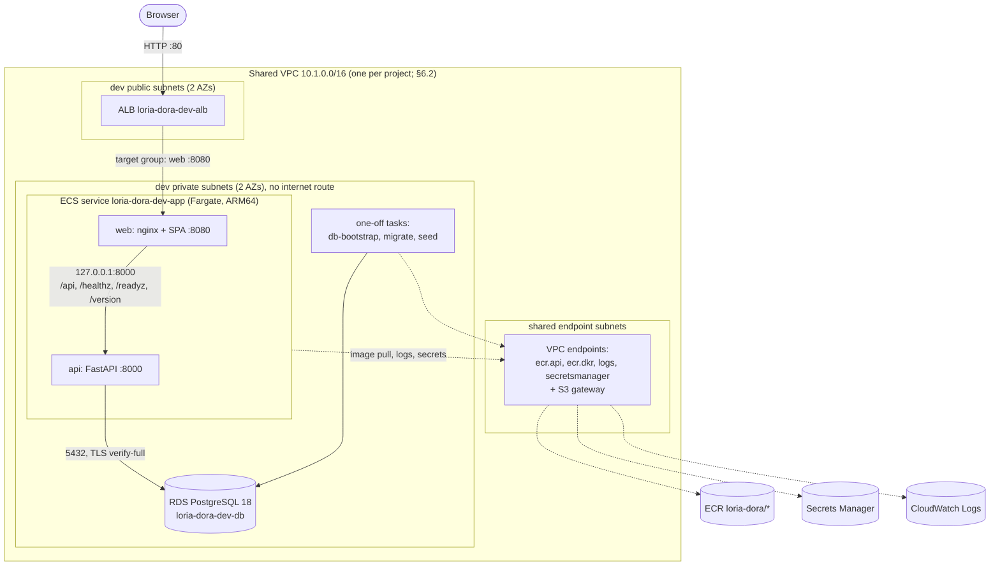

# Cloud & DevOps Design: DORA Deployment Tracker (Phase B)

| | |
|---|---|
| **Author** | M.L. |
| **Status** | Draft v0.3, design only: nothing below is built or provisioned yet (§0). Open items 1–2 resolved. **Dev only: one ECS cluster** |
| **Date** | 2026-09-25 |
| **Depends on** | [`3T-APP-DESIGN.md`](3T-APP-DESIGN.md) v1.0. Phase A is complete: the app runs and is fully tested on localhost, and it meets the portability constraints in §14 of that document. |
| **Reference** | Beacon, `~/Code/CloudDevOps/AWS/three-tier-app-ec2/beacon`, [`docs/CLOUD-DEVOPS-DESIGN.md`](https://github.com/loriamichaelj/beacon/blob/dev/docs/CLOUD-DEVOPS-DESIGN.md). Dora follows Beacon's branch, workflow, bootstrap, state, and IAM patterns. The difference is compute: **ECS on Fargate** instead of EC2 instances, an AMI, and S3 tarballs. |
| **Scope** | Branch, workflow, environment, and infrastructure strategy for running Dora on AWS. **Only the `dev` environment is deployed for now**; stage and prod are designed but not provisioned. |
| **Out of scope** | EKS, multi-region, a custom domain and HTTPS (deferred until a domain exists, §6.10), CDN hosting of the SPA. |

---

## 0. Status

| Area | State |
|---|---|
| Branches and protection (§3) | ✅ Done in Phase A setup: `main`, `dev`, `stage`, `prod`; `main`, `stage`, and `prod` accept changes only through pull requests |
| Scope | **Dev only.** One ECS cluster (`loria-dora-dev`); no stage or prod clusters, databases, load balancers, or subnets. Stage and prod appear in this design so adding them later is configuration, not redesign |
| This design | 📝 Draft for review |
| Everything else | ⏳ Not started. The build order is in §10 |

## 1. Summary

Dora runs on **Amazon ECS with the Fargate launch type**, one ECS cluster per environment. Each environment has an internet-facing Application Load Balancer, one ECS service whose tasks run the `web` (nginx + SPA) and `api` (FastAPI) containers side by side, and an Amazon RDS for PostgreSQL 18 instance. All environments share one VPC. Private subnets have no NAT gateway; they reach AWS services through VPC endpoints only. Container images are built **once**, in dev, pushed to Amazon ECR, and promoted unchanged to stage and prod by digest.

Everything touching AWS runs in **GitHub Actions**, which assumes IAM roles through **OIDC**. There are no access keys anywhere and nothing runs from a laptop. Infrastructure is **Terraform**, with state in S3. As in Beacon, exactly one IAM role and one GitHub Environment are created by hand (§5.2); a workflow creates everything else.

## 2. Guiding principles

These carry over from Beacon unchanged. When a decision comes up that this document doesn't cover, resolve it against these first.

1. **Build once, promote forward.** Images are built once, in dev, and promoted through environments by digest. Stage and prod never build.
2. **Infrastructure lifecycle and app promotion are independent.** Standing an environment up or down is a cost decision; promoting a change is a release decision. A deploy requires the target's infrastructure to exist (§7.4) but never creates it.
3. **No long-lived credentials.** GitHub Actions assumes IAM roles through OIDC. No AWS keys are stored anywhere.
4. **Least privilege, scoped by environment.** A run targeting dev cannot touch stage or prod. This is enforced by IAM, not convention.
5. **Stage and prod always have a gate:** a PR review, a required-reviewer approval, or both.
6. **State and secrets never live in Git.** Terraform state is in S3 with S3-native locking. Secrets are in AWS Secrets Manager and, wherever the provider allows, kept out of Terraform state too (§6.6).
7. **Fail loud, fail fast, fail early.** Preflight checks give clear errors before any AWS mutation.

## 3. Branch strategy

### 3.1 Branches

| Branch | Holds | Protection |
|---|---|---|
| `main` | **Only** GitHub Actions workflows (`.github/workflows/`) and composite actions (`.github/actions/`). Never application code, Terraform, or environment config. Default branch on GitHub. | PR required (ruleset `protected-branches`). The status check **Lint workflows** is required by a second ruleset, `main-required-checks`, that targets `main` alone: `protected-branches` also covers `stage` and `prod`, where that check never runs. |
| `dev` | Application code, Terraform (`infra/`), deploy scripts (`scripts/deploy/`), ECS task-definition templates (`deploy/ecs/`), environment config (`infra/env/environments/*.tfvars`), and the trigger stubs (§3.4). The working branch. | None; direct pushes allowed. |
| `stage` | What was promoted from `dev` by PR. | PR required; no direct push, no force push, no deletion. |
| `prod` | What was promoted from `stage` by PR. | Same as `stage`. |

**`main` is outside the promotion chain.** It never receives a PR from `dev`, `stage`, or `prod`, and never sends one. Workflow changes go on a `workflows/<name>` branch and reach `main` by PR, as in Beacon (PRs #1–#12 there).

### 3.2 Promotion flow

```
work → dev              direct push; dev-ci runs the test suite
dev → PR → stage        validate on every push to the PR; deploy on merge (after approval)
stage → PR → prod       same, with prod's approval
```

Only the first line is in use while dev is the only deployed environment.

### 3.3 Why this shape

There is exactly one copy of every workflow, so pipeline logic can change without a release and can't drift between branches. The cost is that a dispatched workflow must say which branch's content to use, through an explicit `ref` input (§4.1).

### 3.4 Trigger stubs

GitHub runs `push` and `pull_request` workflows from the files on the triggering branch, not from `main`. So thin stubs live on `dev` (and reach `stage`/`prod` by promotion). They contain no logic, only a trigger and a call into the reusable workflow on `main`:

| Stub (on `dev`) | Trigger | Calls |
|---|---|---|
| `dev-ci.yml` | push to `dev` | `test.yml@main` |
| `promote.yml` | PRs into `stage` or `prod` | `deploy.yml@main` in `validate` mode on each push, `deploy` mode on merge. **Designed, not built** until stage exists (§10) |

```yaml
# .github/workflows/dev-ci.yml on dev: a trigger and nothing else
on:
  push:
    branches: [dev]
jobs:
  test:
    uses: loriamichaelj/dora/.github/workflows/test.yml@main
    with:
      ref: ${{ github.sha }}
```

## 4. Pipeline and workflow strategy

### 4.1 How workflows are triggered

Every workflow lives on `main` and runs in one of two ways:

- **`workflow_dispatch`**, from the Actions tab or `gh workflow run`, with explicit inputs: `ref` (which branch's files to check out) and, where relevant, `environment` (which GitHub Environment, and so which IAM role and approval rules, to use). `ref` picks files; `environment` picks credentials and gates. Both must be right.
- **`workflow_call`** from a stub (§3.4).

For stage and prod, the PR merge starts a deploy and the GitHub Environment's required reviewer pauses it before anything changes. That's two independent controls, so no single action by one person changes stage or prod.

### 4.2 Workflow inventory

| File (on `main`) | Purpose | Trigger | GitHub Environment |
|---|---|---|---|
| `bootstrap.yml` | Ensure the state bucket exists, then plan/apply `infra/bootstrap/`: state bucket settings, ECR repositories, the four deploy roles, the task-role permissions boundary | dispatch | `bootstrap` |
| `terraform.yml` | Plan/apply/destroy `infra/network/` (`target=network`) or `infra/env/` for one environment (`target=infra`) | dispatch | `shared` for network; `dev`/`stage`/`prod` for infra |
| `deploy.yml` | Reusable. Version, test, build and push images (dev only), preflight, database bootstrap and migrations, roll out, smoke tests, self-tracking, notify. `validate` mode changes nothing | dispatch (dev), call (from `promote.yml`) | `dev`/`stage`/`prod` |
| `rollback.yml` | Roll an environment back to an earlier release, with safety rules and a dry run | dispatch | `dev`/`stage`/`prod` |
| `seed.yml` | Load the Phase A demo data into **dev** as a one-off ECS task | dispatch | `dev` |
| `test.yml` | Reusable `make ci` (lint, contract check, all tests including E2E): the one definition of green | call, dispatch | none |
| `ci.yml` | actionlint (with shellcheck) on PRs into `main`; its **Lint workflows** check becomes required on `main` | PR → `main`, dispatch | none |
| `.github/actions/pipeline-status` | Composite action: failure notifications (§4.5) | used by deploy and rollback | — |

Plus the stubs on `dev` (§3.4).

### 4.3 Rollback is dispatch-only

As in Beacon: every other stage/prod change goes through a PR, but during an incident a PR cycle is a cost, not a safeguard. `rollback.yml` is dispatch-only and still gated by the Environment's required reviewer.

### 4.4 `terraform.yml`

```yaml
on:
  workflow_dispatch:
    inputs:
      action:      { type: choice, options: [plan, apply, destroy] }
      target:      { type: choice, options: [network, infra] }
      environment: { type: choice, options: [dev, stage, prod] }  # target=infra only
      ref:         { type: string, default: dev }
```

| Target | Root | State key | Variables | Role |
|---|---|---|---|---|
| `network` | `infra/network/` | `env:/shared/network.tfstate` | — | deploy-shared |
| `infra` | `infra/env/` | `env:/<environment>/infra.tfstate` | `infra/env/environments/<environment>.tfvars` | deploy-`<environment>` |

Before any `apply` or `destroy`, the job checks that the backend key, the `.tfvars` file, and the requested environment all agree, and fails otherwise. This catches the most likely costly mistake: applying one environment's variables to another's state. A missing `.tfvars` (stage and prod, for now) fails with a clear message.

### 4.5 Notifications

GitHub-only, as in Beacon. The composite action `pipeline-status` runs at the end of every deploy and every non-dry-run rollback:

- **Failure:** open the issue `[<env>] pipeline failure` (label `pipeline-failure`), assigned to whoever ran the pipeline, or comment on it if it's already open.
- **Success:** if that issue is open, comment **Recovered** with the run link and close it.

GitHub's per-Environment deployment history records every run too. Slack or SNS can be added later without restructuring.

## 5. Environment strategy

### 5.1 The five GitHub Environments

| Environment | What it's for | AWS role (secret `AWS_ROLE_ARN`) | Required reviewers | Deployment branches |
|---|---|---|---|---|
| `bootstrap` | `bootstrap.yml` only | `cloudbatch818-loria-dora-bootstrap` (**created by hand**) | yes | `main` only |
| `shared` | Account-wide resources: the network (and later DNS) | `cloudbatch818-loria-dora-deploy-shared` | yes | `main` only |
| `dev` | dev infrastructure, deploys, rollbacks, seed | `cloudbatch818-loria-dora-deploy-dev` | none | `main` only |
| `stage` | stage (not provisioned yet) | `cloudbatch818-loria-dora-deploy-stage` | yes | `main` only |
| `prod` | prod (not provisioned yet) | `cloudbatch818-loria-dora-deploy-prod` | yes, ideally not stage's reviewer; consider a wait timer | `main` only |

Every workflow runs from `main`, so "deployment branches: `main` only" is the right restriction for all five: it stops a workflow copied onto another branch from ever obtaining a role. Role ARNs are **Environment** secrets, not repository secrets, so a job can only read the ARN of the Environment it runs in.

The **`bootstrap` and `shared`** Environments are not deploy targets. They only scope credentials for account-level work.

### 5.2 Bootstrap: what's manual and why

A workflow can't grant itself AWS access, so the first trust has to be created by hand. Everything after that is Terraform run by a workflow.

**Manual, once (you):**

1. **GitHub OIDC identity provider**: **already exists.** Dora uses the same AWS account as Beacon (open item 1), where this provider was created. Nothing to do; Terraform only reads it.
2. **The bootstrap role**, `cloudbatch818-loria-dora-bootstrap` (IAM → Roles → Web identity), with:
   - the trust policy from `infra/bootstrap/manual/bootstrap-role-trust.json`, allowing only this repo's `bootstrap` Environment:
     ```json
     "token.actions.githubusercontent.com:aud": "sts.amazonaws.com",
     "token.actions.githubusercontent.com:sub": "repo:loriamichaelj@165821667/dora@1387517226:environment:bootstrap"
     ```
     The repository already uses GitHub's **immutable subject** (`owner@owner-id/repo@repo-id`), so a deleted-and-recreated `dora` repo couldn't assume the role.
   - the inline policy from `infra/bootstrap/manual/bootstrap-role-permissions.json`. It can manage only `cloudbatch818-loria-dora-deploy-*` roles and policies, the permissions boundary, the state bucket, and the `loria-dora/*` ECR repositories. Its own name deliberately doesn't match `…-deploy-*`, so it can't modify itself.
3. **The `bootstrap` GitHub Environment**: required reviewer (you), deployment branches `main`, secret `AWS_ROLE_ARN` = the role's ARN.

**Then `bootstrap.yml` (workflow):** `plan`, then `apply`. It creates everything in §5.4 and the four deploy roles.

**Manual, once more (you):** create the `shared`, `dev`, `stage`, and `prod` GitHub Environments (§5.1), each with its role ARN as `AWS_ROLE_ARN`. The job summary of `bootstrap.yml` lists the role names, not ARNs: the repo is public, and ARNs contain the account ID.

Both JSON files ship in the repo with `<ACCOUNT_ID>` placeholders, alongside a step-by-step `infra/bootstrap/README.md`, as in Beacon.

### 5.3 Deploy roles

| Role | Can manage |
|---|---|
| `…-deploy-shared` | The VPC, subnets, routes, internet gateway, VPC endpoints and their security group (and later DNS) |
| `…-deploy-dev` / `-stage` / `-prod` | That environment's infrastructure (`infra/env/`), its task definitions and service, its one-off tasks, its SSM parameters, and reading its own secrets. **Only `deploy-dev` can push to ECR**; stage and prod can only describe images |

Each role trusts only its own Environment's OIDC subject: `repo:loriamichaelj@165821667/dora@1387517226:environment:<env>`.

Policies scope by name pattern (`loria-dora-<env>-*`, `cloudbatch818-loria-dora-<env>-*`) where AWS supports resource ARNs, by the `Project` **and** `Environment` tags where only tag conditions work, and allow `*` only for read-only `Describe*`/`List*` calls. Each unscoped action carries a comment explaining why. ECS-specific points:

- `ecs:RegisterTaskDefinition` has no resource-level control; it's allowed with a request-tag condition, and every family name is prefixed.
- `iam:PassRole` is allowed only for that environment's task and task-execution roles, and only to `ecs-tasks.amazonaws.com`.
- `ecs:RunTask` is allowed only for that environment's task-definition families, and only on its own cluster (`ecs:cluster` condition).
- Roles the deploy role creates (the task roles) must carry the **permissions boundary** `cloudbatch818-loria-dora-task-boundary` (`iam:PermissionsBoundary` condition), so no deploy role can mint a more powerful role than itself.

**Why "build once" is enforced, not just intended:** stage and prod roles have no `ecr:PutImage`, so they physically can't publish an image.

### 5.4 Terraform state in S3

| | |
|---|---|
| Bucket | `loria-dora-tfstate-<account-id>`: versioned, SSE-S3 encrypted, public access blocked, TLS-only bucket policy, noncurrent versions expire after 90 days |
| Keys | `env:/shared/bootstrap.tfstate`, `env:/shared/network.tfstate`, `env:/<env>/infra.tfstate` |
| Locking | S3-native lock files (`use_lockfile = true`). No DynamoDB table; DynamoDB locking is deprecated |
| Backend config | Partial: each root declares `backend "s3" { use_lockfile = true, encrypt = true }`; the workflow passes `bucket`, `key`, and `region` with `-backend-config` |

**The chicken-and-egg problem, solved as in Beacon:** Terraform can't create the bucket its own state lives in. So `bootstrap.yml` first runs `scripts/bootstrap/ensure-state-bucket.sh`. That script, using the bootstrap role:

1. creates the bucket if it's missing (with the right `LocationConstraint` outside us-east-1);
2. blocks public access and enables versioning **before the first state write**;
3. prints only the bucket name on stdout, for the next step.

Then `terraform init` uses that bucket, and `infra/bootstrap/` **imports** it (an `import` block) and manages its remaining settings, with `prevent_destroy`. The script is safe to rerun.

### 5.5 Naming

Set once in `infra/project.env`, loaded by every workflow as environment variables and `TF_VAR_*`:

```sh
AWS_REGION=us-east-1
NAME_PREFIX=loria-dora
IAM_NAME_PREFIX=cloudbatch818-loria-dora
GITHUB_OIDC_SUB_PREFIX=repo:loriamichaelj@165821667/dora@1387517226
```

| Resource | Name |
|---|---|
| ECS cluster / service | `loria-dora-<env>` / `loria-dora-<env>-app` |
| Task-definition families | `loria-dora-<env>-app`, `-migrate`, `-db-bootstrap`, `-seed` |
| ALB / target group | `loria-dora-<env>-alb` / `loria-dora-<env>-web` (both ≤ 32 characters) |
| RDS instance | `loria-dora-<env>-db` |
| ECR repositories (shared) | `loria-dora/api`, `loria-dora/web`, `loria-dora/dbinit` |
| Secrets | `loria-dora/<env>/db-owner`, `/db-app`, `/ingest-api-key` (plus the RDS-managed master secret) |
| SSM parameters | `/loria-dora/<env>/release-version`, `/loria-dora/<env>/deploy-config` |
| Log groups | `/loria-dora/<env>/app`, `/loria-dora/<env>/jobs` |
| IAM | `cloudbatch818-loria-dora-<env>-task`, `…-<env>-task-exec` |

Every resource is tagged `Project=loria-dora`, `Environment=<env|shared>`, `ManagedBy=terraform`. Tag-based IAM conditions check **both** `Project` and `Environment`, so another project's `Environment=dev` resources are out of reach.

The IAM prefix `cloudbatch818-` is the shared account's rule for role names, carried over from Beacon; see open item 1.

## 6. Infrastructure strategy

### 6.1 Architecture



### 6.2 Network

**A VPC of Dora's own**, `10.1.0.0/16`, created once by `terraform.yml target=network`. It's separate from Beacon's so the two projects never depend on each other, and the CIDR doesn't overlap Beacon's `10.0.0.0/16`, in case they're ever peered.

| Environment | Public (ALB) | Private (tasks, RDS) |
|---|---|---|
| dev | `10.1.0.0/24`, `10.1.1.0/24` | `10.1.10.0/24`, `10.1.11.0/24` |
| stage | `10.1.2.0/24`, `10.1.3.0/24` | `10.1.12.0/24`, `10.1.13.0/24` |
| prod | `10.1.4.0/24`, `10.1.5.0/24` | `10.1.14.0/24`, `10.1.15.0/24` |
| shared (endpoints) | — | `10.1.20.0/24`, `10.1.21.0/24` |

Only the **dev** and **shared** subnets are created. The stage and prod ranges are reserved in the plan above but not created until those environments are, if ever.

**No NAT gateway.** Private subnets have no route to the internet. Fargate tasks reach AWS only through VPC endpoints, which is also everything a Fargate task needs (platform 1.4+):

| Endpoint | Type | Why |
|---|---|---|
| S3 | Gateway (free) | ECR stores image layers in S3 |
| `ecr.api`, `ecr.dkr` | Interface | Pull images |
| `logs` | Interface | The `awslogs` log driver |
| `secretsmanager` | Interface | ECS injects secrets into containers at start |

The interface endpoints live in the shared subnets, with their own security group allowing 443 from the VPC CIDR, the design's only CIDR-based rule. There's deliberately **no** `ssm`/`ssmmessages` endpoint: nothing at runtime reads SSM (the workflows read it from outside the VPC), and ECS Exec is deferred (§11).

**Consequences.** No SSH or shell into tasks: operational work runs as one-off ECS tasks (§7.3). Nothing at runtime can reach the internet: an app feature that needs an external API would need a NAT gateway or another endpoint first.

### 6.3 Isolation: security groups

The VPC is shared across environments, so **security groups are the isolation boundary**, and every rule between tiers references a security group ID, never a CIDR:

| From | To | Port | Rule |
|---|---|---|---|
| `0.0.0.0/0` | ALB SG | 80 (443 once DNS lands) | Public entry |
| ALB SG (same env) | Task SG | 8080 | Only this environment's ALB reaches `web` |
| Task SG (same env) | RDS SG | 5432 | Only this environment's tasks, including one-off tasks, reach its database |
| Task SG | Endpoint SG | 443 | Covered by the endpoint SG's VPC-CIDR rule |

`api` listens only on `127.0.0.1` inside the task; there's no rule to port 8000 at all.

### 6.4 Compute: ECS on Fargate

**One ECS cluster, `loria-dora-dev`.** Only dev is deployed, so dev's cluster is the only one created. If stage or prod are ever added, each gets its own cluster, `loria-dora-<env>`, which keeps IAM scoping simple (`ecs:cluster` conditions). The design is written per environment so that's a `.tfvars` file, not a redesign.

**One service, one task shape.** Each task of `loria-dora-<env>-app` runs both containers, sharing the task's network namespace:

| Container | Image | Port | Health check (in the task definition; ECS ignores the image's `HEALTHCHECK`) |
|---|---|---|---|
| `api` (essential) | `loria-dora/api@sha256:…` | 8000 on `127.0.0.1` | `python -c "urllib…/healthz"` (Phase A D1) |
| `web` (essential, `dependsOn: api HEALTHY`) | `loria-dora/web@sha256:…` | 8080 | `wget -q -O /dev/null http://127.0.0.1:8080/index.html` |

`web`'s nginx proxies to `API_UPSTREAM=127.0.0.1:8000`, the same template Phase A uses with `api:8000`. The browser still sees one origin, so there's still no CORS (Phase A D7). With nginx as the only proxy, the api runs with `FORWARDED_ALLOW_IPS=127.0.0.1`, its secure default.

Why one service with two containers, rather than separate `web` and `api` services behind ALB path rules:

- It reproduces exactly the topology Phase A tests: nginx routing, gzip only on static assets (D6), `/metrics` never proxied.
- It needs one target group and one health check.
- The two tiers only scale together at this size anyway.

Splitting later is a Terraform and template change, not an app change (C4).

| Setting | dev | stage / prod (designed) |
|---|---|---|
| CPU / memory (whole task) | 0.5 vCPU / 1 GB | stage 0.5 vCPU / 1 GB; prod 1 vCPU / 2 GB |
| Architecture | **ARM64 (Graviton)**: ~20% cheaper; Phase A images already build for arm64 (D69) | ARM64 |
| Desired count | 1 | 1 / 2, with target-tracking autoscaling on CPU (60%), max 4 |
| Capacity provider | `FARGATE` | `FARGATE` |
| Networking | `awsvpc`, private subnets, no public IP, task SG | same |
| Deployment | rolling: minimum 100% healthy, maximum 200%; **circuit breaker with automatic rollback** | same |
| Health-check grace period | 60 s | 60 s |

### 6.5 Images and ECR

Three **shared** repositories, created by bootstrap (C6):

| Repository | Built from | Used by |
|---|---|---|
| `loria-dora/api` | `api/Dockerfile` | the `api` container, and the `migrate` and `seed` tasks |
| `loria-dora/web` | `web/Dockerfile` | the `web` container |
| `loria-dora/dbinit` | a new `db/Dockerfile` (§8): `postgres:18.6` plus `db/bootstrap.sql` and the RDS CA bundle | the `db-bootstrap` task |

- **Tag immutability on.** Every image is tagged with the release `version` (§7.1) and with `sha-<commit>`; neither can be overwritten.
- **Task definitions reference images by digest** (`repo@sha256:…`), so what runs is exactly what was tested.
- **Scan on push** (basic scanning, free), with findings listed in the deploy summary.
- **Lifecycle:** untagged images expire after 1 day; the newest 50 release versions are kept as rollback targets.
- **Builds run natively on arm64 runners** (`ubuntu-24.04-arm`), free for public repositories, with no emulation.

### 6.6 Database: RDS for PostgreSQL

One instance per environment in that environment's private subnets, reachable only from its task SG.

| Setting | dev | Notes |
|---|---|---|
| Engine | PostgreSQL **18.x** (Phase A requires 18 for `uuidv7()`, D11) | Pin the newest 18 minor RDS offers at implementation (open item 3) |
| Class / storage | `db.t4g.micro`, 20 GB gp3 | |
| Multi-AZ | no | prod: yes |
| Encryption / TLS | at rest (KMS); parameter group `rds.force_ssl = 1` with `apply_method = "pending-reboot"` | The pinned `apply_method` avoids Beacon's perpetual-diff issue |
| Backups | 1 day, no final snapshot, no deletion protection | prod: 7+ days, final snapshot, deletion protection |
| Database | `dora` | |

**Roles, exactly as Phase A designed for RDS (§6.4, D10, D21):**

- **Master user** `dora_admin`: its password is **generated and stored by RDS** in Secrets Manager (`manage_master_user_password = true`), so it never appears in Terraform state. Only the `db-bootstrap` task can read it.
- **`dora_owner`** (DDL, runs migrations) and **`dora_app`** (DML only, runs the API): created by `db/bootstrap.sql`, run by the `db-bootstrap` task. Phase A already proved this against a non-superuser, RDS-style database owner (D21).

**Secrets.** Each environment has three secrets in Secrets Manager: `db-owner` and `db-app` (JSON `{username, password}`) and `ingest-api-key`. Terraform generates the values with **ephemeral** `random_password` resources and writes them with the provider's **write-only** `secret_string_wo`, so they're kept out of state as well (Terraform ≥ 1.11; C7). ECS injects individual JSON keys as environment variables (`valueFrom: <arn>:password::`), matching Phase A's discrete `DB_*` settings (§9 there). Rotation is deferred (§11).

**TLS.** Tasks connect with `DB_SSL_MODE=verify-full` and `DB_SSL_ROOT_CERT` pointing at the RDS global CA bundle baked into the image (§8). Phase A already maps these onto asyncpg and tested `verify-full` rejecting an untrusted certificate (M6).

### 6.7 Load balancer and health checks

An internet-facing ALB in the public subnets, with one listener on HTTP :80 (HTTPS is deferred, §6.10) forwarding to target group `loria-dora-<env>-web` (IP targets, port 8080).

**The target-group health check uses `/healthz`, not `/readyz` (C5).** On ECS, a task that fails its load-balancer health check is **stopped and replaced**. A readiness check that depends on the database would therefore turn a brief database outage into every task being killed. This is Phase A's D1, applied to ECS, and Phase A §14 anticipated it. `/readyz` is still used: deploys and smoke tests wait for it before declaring success.

`/metrics` is never reachable through the ALB, because nginx doesn't proxy it (Phase A §10).

### 6.8 Configuration

A container's environment comes from three places:

| Source | Examples |
|---|---|
| Task-definition template (`deploy/ecs/*.json.tmpl`, versioned with the code) | `PORT`, `LOG_LEVEL`, `APP_ENV=<env>`, `ENABLE_API_DOCS=false`, `DB_NAME`, `DB_SSL_MODE`, `API_UPSTREAM`, `FORWARDED_ALLOW_IPS` |
| Terraform outputs, published as SSM `/loria-dora/<env>/deploy-config` (JSON) | `DB_HOST`, `DB_PORT`, role ARNs, log groups, secret ARNs, subnets, security group, cluster and service names |
| Secrets Manager, via `secrets` in the task definition | `DB_PASSWORD`, `INGEST_API_KEY` |

The image carries `APP_VERSION`, `GIT_SHA`, and `BUILD_TIME` as build arguments, as in Phase A, so `/version` reports exactly what's deployed.

### 6.9 Observability

- **Logs:** the `awslogs` driver ships each container's JSON logs (Phase A §13) to `/loria-dora/<env>/app`, with streams `web/…` and `api/…`. One-off tasks log to `/loria-dora/<env>/jobs`. Retention is 14 days in dev.
- **Deployment history:** ECS service events, GitHub Environment deployments, and the tracker's own records (§7.6).
- **Deferred:** Container Insights, CloudWatch alarms and dashboards, and scraping `/metrics`. The first two cost money per metric; the third needs a collector sidecar (§11).

### 6.10 DNS and HTTPS: deferred

As in Beacon: until a domain exists, each environment's ALB serves HTTP on its AWS DNS name. When one does, a new `infra/dns/` root (`target=dns`, `shared`) adds a hosted zone, a DNS-validated wildcard ACM certificate, an HTTPS :443 listener, and an :80 → :443 redirect. The app doesn't change.

Beacon learned that browsers withhold some APIs, such as `crypto.randomUUID`, on plain-HTTP pages. Dora's UI doesn't use any of them (checked), and the browser smoke test (§7.2) would catch a regression.

### 6.11 Known trade-off: shared VPC

Sharing one VPC across environments pays for one set of interface endpoints (~$58/month) instead of three. A network-level mistake could therefore affect every environment at once. Security groups contain it, but don't eliminate it. That's a deliberate cost choice for a learning-scale project; a production system with real user data would give prod its own VPC or account.

## 7. Deployment and rollback

### 7.1 Release version

As in Beacon, a release is identified by a **content hash**, not a commit SHA:

```bash
printf '%s %s %s' "$(git rev-parse HEAD:api)" "$(git rev-parse HEAD:web)" "$(git rev-parse HEAD:db)" \
  | sha256sum | cut -c1-12
```

Merging `dev` into `stage` creates a new commit, but the same `api/`, `web/`, and `db/` trees produce the same `version`. So stage and prod find exactly the images dev built, and a docs- or infra-only change never rebuilds. The commit SHA is still stamped into each image (`GIT_SHA`) and used as a second tag.

### 7.2 Deploy flow (`deploy.yml`)

Steps 1–3 run **only for dev**. Stage and prod never build.

1. **Version** (§7.1). If ECR already has `api`, `web`, and `dbinit` images tagged with it, skip to step 4.
2. **Test**: `test.yml` (`make ci`).
3. **Build and push**: all three images for `linux/arm64` on an arm64 runner, with `APP_VERSION`, `GIT_SHA`, and `BUILD_TIME` build arguments. Pushed to ECR tagged with `version` and `sha-<commit>`.
4. **Preflight** (§7.4): the environment's infrastructure exists, and the images for `version` exist in ECR. For stage, a missing image means "never deployed to dev" and fails with that message. For prod, `version` must equal stage's current `release-version`, so only exactly what's running in stage reaches prod.
5. **Self-tracking, start**: `record_deploy.py --status in_progress` (§7.6).
6. **Database bootstrap**: run the `db-bootstrap` task (§7.3). It's idempotent (Phase A D21), so it runs on every deploy. It creates the roles on the first deploy and changes nothing afterwards.
7. **Migrate**: register a `migrate` task-definition revision with the new `api` image, run it, and fail the deploy if it fails.
8. **Roll out**: render `deploy/ecs/app.json.tmpl` with the new image digests and `deploy-config`, register it as a new revision of `loria-dora-<env>-app`, and update the service. Then `aws ecs wait services-stable`. The **deployment circuit breaker** rolls the service back automatically if new tasks never become healthy.
9. **Publish** the pointer: write `version` to `/loria-dora/<env>/release-version`.
10. **Smoke tests** against the ALB:
    - **curl:** `/readyz` (with warm-up retries), `/healthz`, `/version` returning this `GIT_SHA`, an API list call, the SPA and a client-side route, and `/metrics` not returning Prometheus output.
    - **Headless browser:** the dashboard and management pages render with no console, page, or API errors.
11. **Self-tracking, finish**: `record_deploy.py --status auto` (§7.6).
12. **Notify** (§4.5).

**Validate mode** (PRs into stage and prod, once they exist) runs step 1, the preflight checks, the tests, and `terraform plan` for the target environment, and changes nothing.

### 7.3 One-off tasks: db-bootstrap, migrate, seed

GitHub runners can't reach the private database, so database work runs **inside the VPC as one-off Fargate tasks**, launched with `aws ecs run-task` on the environment's cluster, in its private subnets, with its task SG. Each workflow step:

1. starts the task;
2. waits with `aws ecs wait tasks-stopped`;
3. prints the task's CloudWatch log stream into the job log;
4. fails unless the essential container exited with 0.

| Task family | Image | Command | Runs as | Reads secret |
|---|---|---|---|---|
| `…-db-bootstrap` | `dbinit` | `psql … -v owner_password=… -v app_password=… -f /bootstrap.sql` | `dora_admin` (RDS master) | master (RDS-managed), `db-owner`, `db-app` |
| `…-migrate` | `api` | `alembic upgrade head` | `dora_owner` | `db-owner` |
| `…-seed` (dev only) | `api` | `python -m app.seed --days 90 --seed 42` | `dora_app` | `db-app` |

This is Phase A's `migrate` and `seed` Compose services moved onto ECS, as its §14 anticipated ("maps to a pre-deploy ECS task"). It's simpler than Beacon's temporary migrator instance with SSM Run Command: there's no instance and no SSM agent, and it takes seconds.

**Migration rule (unchanged from Phase A):** during a rolling deploy, old and new tasks run against the new schema at the same time, and a rollback runs the old image against it. So every migration must be backward-compatible with the previous release (expand, then contract).

### 7.4 Preconditions and the first deploy

`deploy.yml` needs the environment's infrastructure (`terraform.yml target=infra apply`) but never creates it (§2, principle 2). Preflight checks that the cluster, service, and `deploy-config` parameter exist, and fails with a clear message if not ("No ECS service loria-dora-stage-app. Has terraform.yml target=infra been applied for stage?").

**Who owns what (C3):**

| Terraform (`infra/env/`) | The pipeline (`deploy.yml`) |
|---|---|
| Cluster, ALB, target group, listener, security groups, RDS, secrets, log groups, task and execution roles, SSM parameters | Task-definition revisions, which images run, the service's desired count, the `release-version` pointer |
| The service itself, created with **desired count 0** and a placeholder task definition, with `ignore_changes = [task_definition, desired_count]` | Sets the desired count from `deploy-config` on the first deploy |
| `release-version`, created as `none`, with `ignore_changes = [value]` | Writes it on every deploy and rollback |

Starting the service at zero tasks avoids Beacon's first-deploy churn, where instances were replaced every few minutes until the first release landed. Task-definition templates live in the repo and promote with the code, so a new environment variable ships with the release that needs it.

### 7.5 Rollback (`rollback.yml`)

Beacon's model, applied to ECS:

- **Target:** a commit SHA, a release `version`, or by default the **previous release**, read from the `release-version` parameter's history (`get-parameter-history`).
- **Rules**, all checked before anything changes:
  - **published:** the target's images are in ECR;
  - **proven:** the target has run in this environment before (dev may override; stage and prod can't);
  - **schema:** if `api/alembic/versions/` differs between the running release and the target, the target must be the previous release, or `allow_schema_change` must be set.
- **Also required:** a **reason**, recorded in the job summary. **`dry_run`** checks everything and changes nothing.
- **Rollout:** repeat steps 8–12 of the deploy flow with the target's images. If the rollout fails, the service returns to the release that was running. **Rollbacks never run migrations.**

The circuit breaker (§6.4) already covers the most common case, new tasks never becoming healthy, without a human.

### 7.6 Self-tracking in the pipeline

Phase A §15.6 designed this. `deploy.yml` runs the same `scripts/record_deploy.py`, on the runner, against the tracker in the environment being deployed:

```sh
python3 scripts/record_deploy.py --best-effort --no-ensure-service \
  --api-url "http://<alb-dns-name>" --environment development \
  --external-id "gha-${GITHUB_RUN_ID}-${GITHUB_RUN_ATTEMPT}-dev" \
  --status in_progress          # before step 6; --status auto after step 10
```

- Environment names map `dev → development`, `stage → staging`, `prod → production`.
- The ingest key is read from Secrets Manager by the deploy role.
- `--best-effort` means recording can never fail a deploy.
- `--status auto` records `succeeded` only if `/readyz` answers and `/version` reports exactly the deployed commit.
- The first deploy to an empty environment has no tracker to record to yet, so it records nothing, and that's expected.
- The `dora-tracker` service is created once, by hand, in each environment's UI, which is why `--no-ensure-service` is passed.

The staleness check Phase A §15.6 deferred ("`in_progress` for more than 60 minutes") is still deferred (§11).

## 8. Phase A changes required

These are small and happen in milestone B4, on `dev`, with Phase A's full test suite:

1. **RDS CA bundle in the `api` image.** Download `global-bundle.pem` from `truststore.pki.rds.amazonaws.com` at build time and pin its SHA-256 in the Dockerfile. `DB_SSL_ROOT_CERT` then points at it.
2. **`db/Dockerfile`** (the `dbinit` image): `FROM postgres:18.6`, plus `db/bootstrap.sql` and the same CA bundle, running as `postgres`.
3. **`deploy/ecs/`** templates (app, migrate, db-bootstrap, seed) and **`scripts/deploy/`** (preflight, run-one-off-task, render-and-register, smoke tests, rollback rules), testable locally against a stubbed AWS CLI, as in Beacon.
4. **Nothing else.** The Phase A portability constraints (§14 there) already cover configuration by environment variables, discrete DB settings, TLS modes, pool pre-ping, `/healthz` for liveness, SIGTERM handling, arm64 images, relative `/api`, `/version`, `record_deploy.py`'s CI flags, and `make ci` as the single entry point.

## 9. Cost (dev only, us-east-1, approximate)

| Component | Monthly |
|---|---|
| Interface VPC endpoints: 4 × 2 AZs × ~$7.30 | ~$58 |
| ALB | ~$18–24 |
| Fargate ARM64, 1 task × 0.5 vCPU / 1 GB, always on | ~$15 |
| RDS `db.t4g.micro` + 20 GB gp3 | ~$15 |
| Secrets Manager: 4 secrets × $0.40 | ~$2 |
| ECR storage, CloudWatch Logs, S3 state | ~$1–2 |
| **Total** | **~$110** |

**Cost controls**, the same as Beacon's runbook:

- **Tear down dev** with `terraform destroy target=infra` (−$50).
- **Tear down the network** too (−$58), but only after every environment is gone.
- **Never destroy bootstrap.** It holds all state, images, and roles, and costs nearly nothing.

**Cheaper options** (open item 4): interface endpoints in one AZ in dev (−$29); Fargate Spot for dev (−~70% of compute).

## 10. Build order of operations (BOOO), Phase B

Each milestone ends working, with its checks passing. Workflow changes go through PRs into `main`; everything else is committed on `dev`.

| # | Milestone | Done when | Manual steps |
|---|---|---|---|
| **B0** | This design, reviewed | Approved; open items 1–2 answered ✅ | Review |
| **B1** | Workflow foundation: `ci.yml` (actionlint), `test.yml` (`make ci`), the `dev-ci.yml` stub | A push to `dev` runs the test suite on GitHub; **Lint workflows** is required on `main` (ruleset `main-required-checks`) ✅ | — |
| **B2** | Bootstrap: `infra/project.env`, `infra/bootstrap/` (state bucket import, ECR repositories, deploy roles, task boundary), `ensure-state-bucket.sh`, `bootstrap.yml`, and the manual JSON with its README | `bootstrap.yml apply` succeeds twice (the second is a no-op); state is in S3 | **Yes**: bootstrap role, `bootstrap` Environment, then the other four Environments (§5.2) |
| **B3** | Network: `infra/network/`, `terraform.yml` (`target=network`) | VPC, subnets, and endpoints applied through the `shared` Environment | Approve in `shared` |
| **B4** | Phase A changes (§8): CA bundle, `dbinit` image, `deploy/ecs/` templates, `scripts/deploy/` with tests | `make ci` green; scripts tested against a stubbed AWS CLI | — |
| **B5** | dev infrastructure: `infra/env/` + `environments/dev.tfvars`, `terraform.yml target=infra` | Cluster, ALB, RDS, secrets, and the zero-task service exist in dev | — |
| **B6** | `deploy.yml` + `pipeline-status`: the first dev deploy | Dev serves the app at its ALB URL; smoke tests pass; the second deploy is recorded by the tracker | Create `dora-tracker` in dev's UI once |
| **B7** | `rollback.yml`, `seed.yml`, `docs/RUNBOOK.md` | Rollback drilled (back and forth); seed loads; runbook written | — |
| **B8** | Cost and resilience drills: tear dev down and rebuild it from scratch | Rebuilt with no manual steps beyond approvals; costs recorded | — |

**Later, not planned yet:** stage and prod (their `.tfvars`, the `promote.yml` stub, validate mode), DNS and HTTPS.

## 11. Deferred

- Stage and prod infrastructure, `promote.yml`, validate mode (dev-only scope).
- DNS and HTTPS (§6.10).
- Secret rotation, including an `ALTER ROLE` step in `db-bootstrap` so rotated passwords apply to existing roles.
- ECS Exec for interactive debugging (needs `ssmmessages` endpoints, ~$15/month).
- Container Insights, CloudWatch alarms and dashboards, `/metrics` scraping.
- The staleness flag for deployments stuck `in_progress` (Phase A §15.6).
- Automated infrastructure rollback (a manual runbook procedure, as in Beacon).
- Serving the SPA from S3 + CloudFront.
- Splitting `web` and `api` into separate services (C4).

## 12. Open items

1. ~~**AWS account**~~: resolved 2026-09-25. **Same shared account as Beacon**: region `us-east-1`, the `cloudbatch818-` IAM prefix rule applies, and the GitHub OIDC provider already exists, so step 1 of §5.2 is skipped.
2. ~~**Reviewer on the `dev` Environment**~~: resolved 2026-09-25. **None**, as in Beacon.
3. **RDS PostgreSQL 18 minor version.** Pin the newest 18.x RDS offers when B5 is built. It must be 18 for `uuidv7()`.
4. **Dev cost options:** one-AZ endpoints and/or Fargate Spot (§9). The default here is neither.
5. **Prod wait timer** on its Environment. Moot until prod exists.
6. **Where each environment's deploys are recorded** once stage and prod exist: each environment's own tracker (this design), or one central tracker.

## 13. Decision log

| # | Decision | Why | Alternatives rejected |
|---|---|---|---|
| C1 | ECS on **Fargate**, **ARM64** | No instances, AMIs, or Packer to maintain; Graviton is ~20% cheaper; Phase A images are already multi-arch | ECS on EC2 (Beacon's AMI pipeline plus capacity management); EKS (out of scope) |
| C2 | Five GitHub Environments (`bootstrap`, `shared`, `dev`, `stage`, `prod`), each with its own role; deployment branches `main` only | Credentials scoped by Environment; account-level work kept apart from any application environment; only workflows on `main` can obtain a role | Repository-wide secrets; a single role |
| C3 | Terraform owns the infrastructure and the service's existence (starting at 0 tasks); the pipeline owns task-definition revisions, images, desired count, and the `release-version` pointer | A clear owner for every field avoids Terraform and deploys fighting over the service; starting at 0 tasks avoids first-deploy churn; templates promote with the code | Terraform applies every release; task definitions only in Terraform |
| C4 | One service, with `web` and `api` as containers in the same task; nginx proxies to `127.0.0.1:8000` | Reproduces exactly what Phase A tests; one target group; tiers scale together at this size | Two services with ALB path routing (possible later without app changes) |
| C5 | The ALB target-group health check is `/healthz`; deploys gate on `/readyz` | ECS replaces tasks that fail load-balancer checks, so a DB-dependent check would turn a DB blip into killing every task (Phase A D1) | `/readyz` for the target group |
| C6 | Shared ECR repositories created by bootstrap; tags immutable; images referenced by digest; only `deploy-dev` can push | Build once, enforced by IAM; no environment can publish images | Per-environment repositories; S3 tarballs (Beacon's choice, impossible on Fargate) |
| C7 | RDS manages the master password; the app and owner passwords use ephemeral values and write-only secret arguments | Keeps every database password out of Terraform state | Beacon's approach: passwords in encrypted state |
| C8 | `db/bootstrap.sql` runs on every deploy as a one-off task using the `dbinit` image | It's idempotent and already proven against an RDS-style non-superuser (Phase A D21); running it always makes environments self-healing | A separate manual bootstrap step |
| C9 | Database work (bootstrap, migrations, seed) runs as one-off Fargate tasks | The database is private; one-off tasks need no instance or SSM agent and finish in seconds | Beacon's migrator EC2 instance with SSM Run Command |
| C10 | A VPC of Dora's own, `10.1.0.0/16`, shared by Dora's environments, with no NAT; four interface endpoints plus the S3 gateway | Projects stay independent; no internet egress; the endpoints are exactly what Fargate needs | Reusing Beacon's VPC (it lacks the ECR and Secrets Manager endpoints, and couples the projects); a NAT gateway |
| C11 | State in `loria-dora-tfstate-<account-id>`, created by `ensure-state-bucket.sh` before `terraform init` and then imported by bootstrap; S3-native locking | Terraform can't create its own state bucket; Beacon's proven pattern | Local state; DynamoDB locking (deprecated) |
| C12 | Release `version` is a hash of the `api/`, `web/`, and `db/` Git trees | Survives promotion merges; infra- and docs-only changes don't rebuild | Commit SHA |
| C13 | The deploy pipeline self-records through `record_deploy.py` with `--best-effort` | Phase A §15.6: one code path; recording never breaks a deploy | Recording from inside the cluster |
| C14 | **Only dev is built and deployed: one ECS cluster (`loria-dora-dev`), one database, one ALB, and only dev's and the shared subnets.** Stage and prod exist as GitHub Environments, deploy roles, and branch protection only, with no AWS infrastructure | Cost; every mechanism is proven in dev first, as Beacon did | Provisioning all three now |
